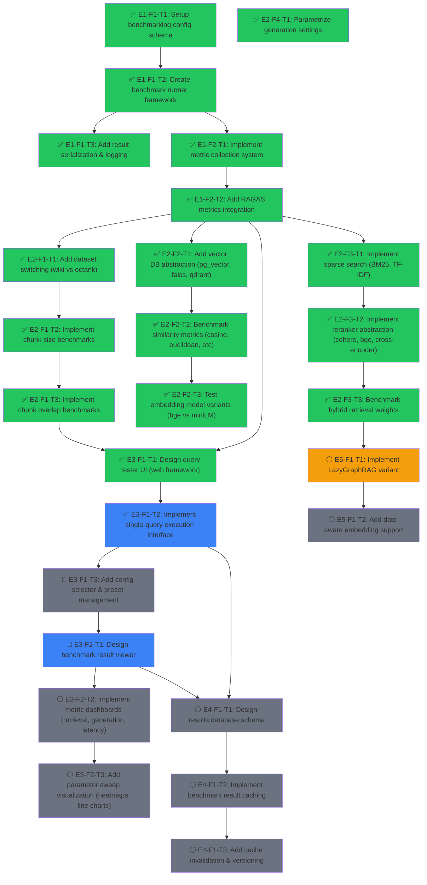

# EvenementsRAG Roadmap

## Project Overview

EvenementsRAG is a progressive RAG benchmarking system for historical events (WW2), designed to systematically evaluate and compare different RAG techniques, retrieval parameters, and generation configurations. The project has successfully implemented a hybrid RAG baseline with 10k Wikipedia articles and is expanding into comprehensive benchmarking infrastructure with parameterized evaluation and visualization.

**Current State**: Phase 1 baseline (vanilla RAG) and Phase 2 (hybrid RAG + temporal) evaluated on 49 articles. Benchmarking config schema (E1-F1-T1) and runner framework (E1-F1-T2) implemented and unit-tested. Next: result serialization (E1-F1-T3) and metric collection (E1-F2-T1). Goal: Build a complete benchmarking framework with UI to test arbitrary configurations and visualize results.

---

## Dependency Graph

---

## Epics & Tasks

### 🏗 E1: Core Benchmarking Infrastructure

The foundation for parameterized evaluation. Establishes config management, metric collection, and result logging.

#### E1-F1: Benchmark Configuration & Execution

##### ✅ E1-F1-T1: Setup benchmarking config schema
- blocked_by: []
- status: done
- effort: M
- agent_hint: Create YAML/Pydantic schema for benchmark config (dataset, vector_db, chunk_size, embeddings, rag_technique, reranker, generation_params). Should support presets and CLI override.
- description: Define the configuration structure for parameterized benchmarks. Must support all parameters from benchmark.md (retrieval params, generation params, metrics config). Create Pydantic BaseModel for validation and serialization.

##### ✅ E1-F1-T2: Create benchmark runner framework
- blocked_by: [E1-F1-T1]
- status: done
- effort: L
- agent_hint: Implement BenchmarkRunner class that takes a config, initializes the RAG pipeline, runs queries, collects results in standardized format. Should be composable and support batching.
- description: Build the main benchmarking orchestrator. Takes a config, sets up the RAG system, executes evaluation questions, and returns structured results (retrieval metrics, generation metrics, latency). Must be reusable across different phases.

##### ✅ E1-F1-T3: Add result serialization & logging
- blocked_by: [E1-F1-T2]
- status: done
- effort: S
- agent_hint: Save benchmark results to JSON with timestamp, config, all metrics. Add structured logging with timestamps and config hashing for traceability.
- description: Implement JSON serialization for benchmark results with config, timestamps, and result metadata. Add logging to track benchmark execution.

#### E1-F2: Metric Collection & Evaluation

##### ✅ E1-F2-T1: Implement metric collection system
- blocked_by: [E1-F1-T2]
- status: done
- effort: M
- agent_hint: Create MetricsCollector class that computes retrieval metrics (Hit@K, MRR, NDCG), generation metrics (ROUGE, BERTScore), and latency metrics. Should be modular per metric type.
- description: Build a unified metrics collection system supporting all metrics from benchmark.md: retrieval (Article Hit@K, Chunk Hit@K, MRR), generation (ROUGE-L, BERTScore), and latency (p95, p99).

##### ✅ E1-F2-T2: Add RAGAS metrics integration
- blocked_by: [E1-F2-T1]
- status: done
- effort: L
- agent_hint: Integrate RAGAS library for faithfulness, answer_relevancy, context_precision, context_recall, context_entity_recall, answer_similarity, answer_correctness, harmfulness, maliciousness, coherence, correctness, conciseness. Handle LLM-based metrics with caching.
- description: Integrate RAGAS metrics for generation quality. All 11+ RAGAS metrics from benchmark.md must be collected. Must handle API rate limiting and result caching.

---

### 📊 E2: Parameter Benchmarking System

Implements parameterized testing across all dimensions: datasets, vector DBs, chunk configs, embeddings, RAG techniques, rerankers, and generation params.

#### E2-F1: Dataset & Preprocessing Parameters

##### ✅ E2-F1-T1: Add dataset switching (wiki vs octank)
- blocked_by: [E1-F2-T2]
- status: done
- effort: M
- agent_hint: Abstract dataset source via DatasetManager. Implement loaders for: (1) Wikipedia 10k articles, (2) OctankFinancial dataset. Support config-driven switching.
- description: Implement dataset abstraction to benchmark against multiple sources (Wikipedia WW2 vs OctankFinancial). Must support loading, caching, and easy switching via config.

##### ✅ E2-F1-T2: Implement chunk size benchmarks
- blocked_by: [E2-F1-T1]
- status: done
- effort: S
- agent_hint: Parametrize chunk_size in preprocessing. Re-chunk articles with sizes: 256, 512, 1024. Track chunking overhead and quality impact.
- description: Enable benchmarking chunk sizes (256, 512, 1024 tokens). Must re-chunk datasets dynamically based on config and track impact on retrieval quality.

##### ✅ E2-F1-T3: Implement chunk overlap benchmarks
- blocked_by: [E2-F1-T2]
- status: done
- effort: S
- agent_hint: Add chunk_overlap parameter to preprocessor. Test with overlap values: 0, 50, 128, 256. Track quality vs storage trade-off.
- description: Benchmark chunk overlap values (0, 50, 128, 256). Must support dynamic re-chunking and measure impact on retrieval precision.

#### E2-F2: Vector Database & Similarity Metrics

##### ✅ E2-F2-T1: Add vector DB abstraction (pg_vector, faiss, qdrant)
- blocked_by: [E1-F2-T2]
- status: done
- effort: L
- agent_hint: Create VectorStoreFactory with support for: (1) Qdrant (in-memory & server), (2) FAISS (file-based), (3) pgvector (PostgreSQL). Implement common interface for search, indexing, filtering.
- description: Implement abstraction layer for vector databases (Qdrant, FAISS, pgvector). Must support indexing, search, filtering, and latency measurement per DB backend.

##### ✅ E2-F2-T2: Benchmark similarity metrics (cosine, euclidean, dot_product, manhattan, ANN)
- blocked_by: [E2-F2-T1]
- status: done
- effort: M
- agent_hint: Add similarity_metric parameter to vector store. Benchmark: cosine, euclidean, dot_product, manhattan, and ANN variants. Measure retrieval quality and latency per metric.
- description: Test different similarity metrics (cosine, euclidean, dot product, manhattan, ANN methods). Must collect both quality and latency metrics per similarity approach.

##### ✅ E2-F2-T3: Test embedding model variants (bge vs miniLM)
- blocked_by: [E2-F2-T2]
- status: done
- effort: M
- agent_hint: Create EmbeddingFactory supporting: (1) bge-base (BAAI), (2) all-MiniLM-L12 (current), others as expandable. Re-embed articles and benchmark retrieval quality.
- description: Benchmark embedding models: bge-base, all-MiniLM-L6-v2, all-MiniLM-L12. Measure retrieval quality and embedding computation overhead per model.

#### E2-F3: Retrieval Techniques & Reranking

##### ✅ E2-F3-T1: Implement sparse search (BM25, TF-IDF)
- blocked_by: [E1-F2-T2]
- status: done
- effort: M
- agent_hint: Extend retriever to support: (1) Pure BM25, (2) Pure TF-IDF, (3) Combined w/ dense. Support configurable parameters (k1, b for BM25). Benchmark vs dense retrieval.
- description: Implement sparse retrieval methods (BM25, TF-IDF) as alternatives/supplements to dense retrieval. Must support standalone and hybrid configurations.

##### ✅ E2-F3-T2: Implement reranker abstraction (cohere, bge, cross-encoder)
- blocked_by: [E2-F3-T1]
- status: done
- effort: M
- agent_hint: Create RerankerFactory with: (1) No reranker, (2) Cohere v3, (3) bge-reranker-v2, (4) cross-encoder. Measure reranking latency and quality impact.
- description: Implement reranker abstraction supporting multiple backends (none, Cohere, BGE, cross-encoder). Measure quality improvement and latency cost.

##### ✅ E2-F3-T3: Benchmark hybrid retrieval weights
- blocked_by: [E2-F3-T2]
- status: done
- effort: M
- agent_hint: Add hybrid_weight parameter. Test BM25 weights: 0% (pure dense), 10%, 15%, 20%, 30%, 50%. Track quality impact of hybrid fusion method (RRF, weighted sum, etc).
- description: Benchmark hybrid retrieval with different BM25/dense weight combinations (0%, 10%, 15%, 20%, 30%, 50%). Test RRF, weighted sum, and other fusion methods.

#### E2-F4: Generation Parameters

##### ✅ E2-F4-T1: Parametrize generation settings
- blocked_by: [E1-F2-T2]
- status: done
- effort: M
- agent_hint: Add top_k_chunks, top_k_articles, llm_model, prompt_template to config. Support LLM model switching (free OpenRouter models). Benchmark generation quality & latency.
- description: Make generation configurable: top_k_chunks, top_k_articles, LLM model selection, prompt templates. Measure impact on answer quality and latency.

---

### 🎨 E3: UI & Visualization Layer

Web interface for testing individual queries and visualizing benchmark results.

#### E3-F1: Query Tester Interface

##### ✅ E3-F1-T1: Design query tester UI (web framework)
- blocked_by: [E1-F1-T3, E1-F2-T2]
- status: done
- effort: L
- agent_hint: Choose web framework (FastAPI + React, or Streamlit). Design single-page app with: config selector, query input, live execution, result display showing retrieval + generation steps. Reference benchmark.md UI spec.
- description: Build interactive query testing UI. User can select config preset, enter query, execute, and see detailed retrieval and generation results with latency breakdown.

##### ✅ E3-F1-T2: Implement single-query execution interface
- blocked_by: [E3-F1-T1]
- status: done
- effort: M
- agent_hint: Implement backend endpoint for single query execution with specific config. Return: retrieved chunks, reranked order, generation result, latency breakdown, all metrics.
- description: Implement query execution API endpoint. Takes query + config, returns full trace of retrieval, ranking, and generation steps.

##### 🔵 E3-F1-T3: Add config selector & preset management
- blocked_by: [E3-F1-T2]
- status: ready
- effort: S
- agent_hint: UI component for config selection (presets: Phase1, Phase2, Phase3+variants). Allow quick switching between common configs, display current settings, allow one-off parameter override.
- description: Add UI for config management. Support preset configs (Phase1, Phase2, Phase3 variants) with quick switching and parameter overrides.

#### E3-F2: Benchmark Results Viewer

##### 🔵 E3-F2-T1: Design benchmark result viewer
- blocked_by: [E3-F1-T1]
- status: ready
- effort: M
- agent_hint: Design dashboard showing: config used, all retrieval metrics (Hit@K, MRR), all generation metrics (ROUGE, BERTScore, RAGAS), latency percentiles. Support filtering/searching results.
- description: Build results dashboard showing all computed metrics for a benchmark run, with filters for config parameters and result sorting.

##### ⚪ E3-F2-T2: Implement metric dashboards (retrieval, generation, latency)
- blocked_by: [E3-F2-T1]
- status: pending
- effort: M
- agent_hint: Create tab-based view: (1) Retrieval metrics table, (2) Generation metrics table, (3) Latency distribution (box plot p95/p99). Support export to CSV.
- description: Implement detailed metric views by category (retrieval, generation, latency) with tabular display and basic visualizations.

##### ⚪ E3-F2-T3: Add parameter sweep visualization (heatmaps, line charts)
- blocked_by: [E3-F2-T2]
- status: pending
- effort: L
- agent_hint: Create multi-result analyzer. User fixes all params except one (e.g., chunk_size), view quality change as line chart. Support 2D heatmaps for two varying params. Use Plotly for interactivity.
- description: Visualization for parameter sensitivity analysis. Line charts for single-param sweeps, heatmaps for two-param comparisons. Show how metrics vary with parameter changes.

---

### 💾 E4: Results Caching & Database

Persistent storage for benchmark results with intelligent caching.

#### E4-F1: Result Storage & Caching

##### ⚪ E4-F1-T1: Design results database schema
- blocked_by: [E3-F1-T2, E3-F2-T1]
- status: pending
- effort: S
- agent_hint: Design normalized schema: (1) Benchmark runs table (config hash, timestamp, status), (2) Metric results (run_id, metric_name, value), (3) Query results (run_id, query, chunks_retrieved, generation_result). Support versioning.
- description: Design database schema for storing benchmark runs, metrics, and query results with versioning and traceability.

##### ⚪ E4-F1-T2: Implement benchmark result caching
- blocked_by: [E4-F1-T1]
- status: pending
- effort: M
- agent_hint: Implement ResultCache: (1) Config hashing (deterministic hash of all params), (2) Check if config already evaluated, (3) Return cached results if available, (4) Compute new results otherwise. Support both file and DB backends.
- description: Implement caching layer. When benchmarking a config, check if already computed and return cached results. Support both file and database backends.

##### ⚪ E4-F1-T3: Add cache invalidation & versioning
- blocked_by: [E4-F1-T2]
- status: pending
- effort: S
- agent_hint: Implement version tracking for codebase and dataset. Cache entries tagged with code version + dataset version. Clear cache on data/code changes. Support manual cache busting.
- description: Track cache validity via code and dataset versions. Implement cache invalidation on significant changes (code updates, dataset refreshes).

---

### 🚀 E5: Advanced RAG Techniques

Later-phase implementations for advanced retrieval methods.

#### E5-F1: Advanced RAG Methods

##### 🔵 E5-F1-T1: Implement LazyGraphRAG variant
- blocked_by: [E2-F3-T3]
- status: ready
- effort: L
- agent_hint: Implement lightweight graph-based retrieval without full Neo4j. Extract entities/relationships from chunks, build lightweight graph, support path-based retrieval. Benchmark vs hybrid.
- description: Implement a simplified graph RAG approach using entity/relationship extraction without full knowledge graph infrastructure. Benchmark against hybrid retrieval.

##### ⚪ E5-F1-T2: Add date-aware embedding support
- blocked_by: [E5-F1-T1]
- status: pending
- effort: M
- agent_hint: Experiment with temporal embeddings: (1) Concatenate temporal metadata to embeddings, (2) Learn temporal offset adjustments, (3) Time-weighted similarity. Benchmark on temporal questions.
- description: Implement date-aware embeddings that incorporate temporal metadata. Measure improvement on temporal question types.

---

## Critical Path

🔴 **E1-F1-T1 → E1-F1-T2 → E1-F1-T3 → E1-F2-T1 → E1-F2-T2 → E2-F1-T1 → E2-F1-T2 → E2-F1-T3 → E3-F1-T1 → E3-F1-T2 → E3-F1-T3 → E3-F2-T1 → E3-F2-T2 → E3-F2-T3**

**Length**: 14 tasks (critical blocking path)

This is the path to a complete benchmarking + visualization system. Shorter paths exist for partial functionality (e.g., just CLI benchmarking without UI).

---

## Parallel Opportunities

⚡ **Parallel Group A** (after E1-F2-T2):
- E2-F1-T1, E2-F2-T1, E2-F3-T1, E2-F4-T1 can all start independently
- **Benefit**: Build out all parameter dimensions in parallel before merging for UI

⚡ **Parallel Group B** (after E3-F1-T1):
- E3-F1-T2 and E3-F2-T1 can design/implement in parallel
- **Benefit**: Query tester and results viewer are independent components

⚡ **Parallel Group C** (after E2-F3-T3):
- E4-F1-T1, E5-F1-T1 can start (storage design and advanced RAG don't block each other)
- **Benefit**: Database schema and advanced methods developed in parallel

---

## Done

✅ **Phase 0 – Foundation** (completed)
- Project structure established
- Configuration management (config/settings.py)
- Question taxonomy (docs/question_types_taxonomy.md)
- Qdrant setup (scripts/setup_qdrant.sh)

✅ **Data Ingestion – 10k Articles** (completed)
- Wikipedia scraper (scripts/scrape_10k_articles.py) — fetches 10k+ articles
- Article indexing (src/preprocessing/, src/vector_store/)
- Metadata extraction (categories, links, word counts)

✅ **Phase 1 – Vanilla RAG** (completed)
- Embedding generation (sentence-transformers/all-MiniLM-L6-v2)
- Qdrant indexing (1849 chunks from 49 articles)
- Baseline evaluation (50 questions, retrieval + generation metrics)
- Phase1 vs Phase2 comparison (CHANGELOG.md results)

✅ **Phase 2 – Hybrid RAG + Temporal** (completed)
- BM25 sparse search (rank-bm25 integration)
- RRF fusion (Reciprocal Rank Fusion with k=60)
- Temporal extraction & filtering (year/timeframe patterns)
- Evaluation framework (chunk-based ground truth, Hit@K metrics)

✅ **Phase 3 – Evaluation Infrastructure** (in progress)
- Question generation (200 eval questions, chunk-based)
- Metrics collection (Article Hit@K, Chunk Hit@K, MRR, ROUGE, BERTScore)
- Evaluation harness (run_evaluation.py, benchmark runner)

✅ **E1-F1-T1 – Benchmarking Config Schema**
- `BenchmarkConfig` + 7 Pydantic v2 sub-models (DatasetConfig, EmbeddingConfig, ChunkingConfig, RetrievalConfig, RerankerConfig, GenerationConfig, EvaluationConfig)
- SHA-256 config hashing (16-char, excludes name/description for cache stability)
- YAML round-trip I/O, named presets (`phase1_vanilla`, `phase2_hybrid`)
- Preset files: `config/benchmarks/phase1_vanilla.yaml`, `config/benchmarks/phase2_hybrid.yaml`

✅ **E2-F1-T2 & E2-F1-T3 – Chunk Size & Overlap Sweep Methods**
- `BenchmarkConfig.chunk_size_sweep(base, sizes)`: returns list of configs varying chunk_size (default 256/512/1024)
- `BenchmarkConfig.chunk_overlap_sweep(base, overlaps)`: returns list of configs varying chunk_overlap (default 0/50/128/256); skips overlaps >= chunk_size with `UserWarning`
- Collection name pattern: `{dataset_name}_cs{size}_co{overlap}` (e.g., `wiki_10k_cs256_co50`)
- 6 YAML presets: `sweep_cs256_co50.yaml`, `sweep_cs512_co50.yaml`, `sweep_cs1024_co50.yaml`, `sweep_cs512_co0.yaml`, `sweep_cs512_co128.yaml`, `sweep_cs512_co256.yaml`
- 13 new unit tests in `TestSweeps` (all passing)

✅ **E2-F2-T1 – Vector DB Abstraction**
- `BaseVectorStore` ABC + `DistanceMetric` enum (`src/vector_store/base.py`)
- `QdrantAdapter` wrapping `QdrantManager` (`src/vector_store/qdrant_adapter.py`)
- `FAISSStore` with sidecar metadata + persistence (`src/vector_store/faiss_store.py`)
- `PgVectorStore` with JSONB payloads (`src/vector_store/pgvector_store.py`)
- `VectorStoreFactory` with lazy-import registry (`src/vector_store/factory.py`)
- `VectorDBConfig` Pydantic sub-model added to `BenchmarkConfig`
- Runner uses `VectorStoreFactory.from_config()` instead of direct `QdrantManager()`
- **Unit tests**: `tests/unit/vector_store/` — 67 tests passed (5 pgvector skipped), 100% coverage on base/factory

✅ **E2-F2-T2 – Benchmark Similarity Metrics**
- `default_distance` instance attribute on `BaseVectorStore` + all 3 implementations
- `create_collection(distance=None)` resolves to `self._default_distance`
- `VectorStoreFactory.from_config()` passes `default_distance=DistanceMetric(config.distance_metric)`
- `BenchmarkConfig.distance_metric_sweep()` → 3 configs (cosine, euclidean, dot_product); manhattan excluded
- YAML presets: `config/benchmarks/wiki_dm_{cosine,euclidean,dot_product}.yaml`
- Collection naming: `ww2_dm_{metric}`
- **Unit tests**: `tests/unit/vector_store/test_distance_metric_flow.py` + additions to `test_config.py`, `test_factory.py`

✅ **E2-F2-T3 – Embedding Model Variants**
- `_EMBEDDING_SWEEP_MODELS` registry + `BenchmarkConfig.embedding_model_sweep()` → 4 configs (minilm_l6, minilm_l12, bge_small, bge_base)
- Known-model validator expanded with `all-MiniLM-L12-v2` (384), `BAAI/bge-small-en-v1.5` (384), `BAAI/bge-base-en-v1.5` (768)
- Runner bug fix: passes `model_name=self.config.embedding.model_name` to `EmbeddingGenerator()`
- Cache hash fix: `_hash_text` now includes `self.model_name` to prevent cross-model contamination
- YAML presets: `config/benchmarks/wiki_em_{minilm_l6,minilm_l12,bge_small,bge_base}.yaml`
- Collection naming: `ww2_em_{short_name}`
- **Unit tests**: `tests/unit/benchmarks/test_embedding_sweep.py` — 18 tests (sweep, validator, runner plumbing, cache hash)

✅ **E1-F2-T1 – Metric Collection System**
- `MetricsCollector` class in `src/evaluation/metrics_collector.py` — computes ROUGE-L, BERTScore (lazy-imported), latency percentiles (p50/p95/p99)
- `GenerationMetrics`, `LatencyMetrics`, `AggregatedGenerationMetrics` dataclasses
- Wired into `ParameterizedBenchmarkRunner.run()` — `metrics_summary` field on `BenchmarkResult`
- Fixed pre-existing `self._qdrant` → `self._vector_store` bug in runner.py
- **Unit tests**: `tests/unit/evaluation/test_metrics_collector.py` — 31 tests (all mocked, no heavy deps)
- **Total**: 233 tests pass, 5 pgvector skipped

✅ **E1-F2-T2 – RAGAS Metrics Integration**
- `RagasEvaluator` class in `src/evaluation/ragas_evaluator.py` — 12 RAGAS metrics via `ragas.evaluate()`
- `RagasResult` dataclass with `to_dict()` (excludes None values)
- Metric registry: 7 core metrics (faithfulness, answer_relevancy, context_precision/recall, entity_recall, answer_similarity/correctness) + 5 AspectCritic variants (harmfulness, maliciousness, coherence, correctness, conciseness)
- `MetricsCollector.compute_ragas_metrics()` delegates to `RagasEvaluator`; `get_summary()` includes `"ragas"` section
- `_run_generation_pass()` stores `retrieved_contexts` for RAGAS consumption
- `EvaluationConfig` gains 4 fields: `ragas_metrics`, `ragas_evaluator_model`, `ragas_max_workers`, `ragas_timeout`
- `print_summary()` displays per-metric RAGAS averages
- **Dependencies**: ragas 0.4.3, langchain-openai, langchain-huggingface added to pyproject.toml
- **Unit tests**: `tests/unit/evaluation/test_ragas_evaluator.py` — 16 tests (all mocked); updates to test_metrics_collector (6 tests), test_runner (2 tests), test_config (4 tests)
- **Total**: 261 tests pass, 5 pgvector skipped

✅ **E2-F3-T1/T2/T3 – Sparse Search, Reranker Abstraction, Hybrid Weight Sweep**
- **Sparse search**: `TFIDFIndex` in `src/retrieval/tfidf_search.py`; `HybridSearcher` gains `sparse_type` param dispatching to BM25 or TF-IDF
- **Reranker**: `BaseReranker` ABC + `NoOpReranker`, `CohereReranker`, `BGEReranker`, `CrossEncoderReranker` in `src/retrieval/reranker.py`; `RerankerFactory` in `src/retrieval/reranker_factory.py`
- **Hybrid retriever**: `HybridRetriever(BaseRAG)` in `src/rag/phase3_hybrid/retriever.py`; wired into `_RAG_REGISTRY["hybrid"]`
- **Weight sweep**: `hybrid_weight_sweep()` classmethod; 6 YAML presets (`wiki_hybrid_w{0,10,15,20,30,50}.yaml`)
- **Collection naming**: `ww2_hybrid_w{pct}`
- **Unit tests**: `test_tfidf_search.py`, `test_reranker_factory.py`, `test_hybrid_retriever.py`, `test_hybrid_sweep.py`
- **Total**: 242 tests pass, 5 pgvector skipped

✅ **E3-F1-T1 – Query Tester UI (FastAPI + React)**
- **Architecture**: FastAPI backend (`src/api/`) + Vite/React/TypeScript/Tailwind frontend (`frontend/`)
- **Backend endpoints**: `GET /api/health`, `GET /api/presets`, `GET /api/presets/{filename}`, `POST /api/query` (stub with mock data)
- **Frontend**: Sidebar navigation, QueryTester page with PresetSelector, ConfigSummary, ChunkList, GeneratedAnswer, LatencyBreakdown, ChunkScoresChart (Plotly.js)
- **Placeholder pages**: BenchmarkViewer (E3-F2-T1), MetricDashboards (E3-F2-T2), SweepVisualizer (E3-F2-T3)
- **Dev workflow**: `uvicorn src.api.main:app --reload --port 8000` + `cd frontend && npm run dev` (Vite proxies `/api` to backend)
- **Dependencies**: fastapi>=0.115.0, uvicorn[standard]>=0.30.0 (Python); react, react-router-dom, tailwindcss, plotly.js, react-plotly.js (npm)
- **Unit tests**: `tests/unit/api/` — 18 tests (health, presets, query stub)

✅ **E1-F1-T2 – Benchmark Runner Framework**
- `ParameterizedBenchmarkRunner`: drives evaluation from a `BenchmarkConfig`
- `BenchmarkResult` dataclass with `to_dict()`, `to_json()`, `print_summary()`
- `run()`: initialises shared deps (QdrantManager, EmbeddingGenerator), builds RAG pipeline, delegates to legacy `BenchmarkRunner`, optional generation pass
- `run_sweep()`: batches multiple configs, skips `NotImplementedError` by default, saves per-result JSON
- `_RAG_REGISTRY`: lazy-import dispatch (vanilla implemented; hybrid/temporal raise `NotImplementedError` until E2-F3)
- **Unit tests**: `tests/unit/benchmarks/` — 39 tests, 98% coverage on `config.py`, 90% on `runner.py`

---

## Summary

| Metric | Value |
|--------|-------|
| **Total Tasks** | 33 |
| **Done** | 17 (E1-F1-T1, E1-F1-T2, E1-F1-T3, E1-F2-T1, E1-F2-T2, E2-F1-T1, E2-F1-T2, E2-F1-T3, E2-F2-T1, E2-F2-T2, E2-F2-T3, E2-F3-T1, E2-F3-T2, E2-F3-T3, E2-F4-T1, E3-F1-T1, E3-F1-T2) |
| **Ready (no blockers)** | 3 (E3-F1-T3, E3-F2-T1, E5-F1-T1) |
| **In Progress** | 0 |
| **Pending** | 13 |
| **Critical Path Length** | 14 sequential tasks (7 remaining) |
| **Parallel Groups** | 3 major opportunities (A: params, B: UI, C: storage/advanced) |

**Next Immediate Steps** (Ready to start):
1. E3-F1-T3: Add config selector & preset management
2. E3-F2-T1: Design benchmark result viewer
3. E5-F1-T1: Implement LazyGraphRAG variant

**Parallel Group A** (E2 parameters) is complete. **Parallel Group B** (UI) in progress — E3-F1-T1 and E3-F1-T2 done, E3-F1-T3 and E3-F2-T1 ready.

---

## Architecture Decisions

### E1-F1-T1 — BenchmarkConfig schema

**Pydantic v2 with 7 nested sub-models** (not dataclasses or plain dicts).
Rationale: validators run at construction time (`model_validator`), YAML round-trip is trivial via `model_dump()` / `model_validate()`, and Pydantic v2 is already a project dependency.

**`config_hash` excludes `name` and `description`** (SHA-256 of remaining fields, first 16 hex chars).
Rationale: renaming a benchmark run must not invalidate the E4 result cache — only parameter changes should bust the hash.

### E2-F1-T1 — DatasetManager

**`DATASET_REGISTRY` as a module-level dict** in `dataset_manager.py` (not config YAML).
Rationale: datasets are code-level concerns (path conventions, loader logic), not user-level config. Keeping the registry in code allows validator and manager to import it at zero runtime cost.

**`articles_dir: Optional[str]` on DatasetConfig** (not `Path`).
Rationale: Pydantic serializes `str` to YAML cleanly; `Path` objects serialize as strings anyway but add a round-trip conversion concern. `DatasetManager.get_articles_dir()` converts to `Path` at use time.

**`ensure_indexed` checks `collection_exists` before indexing**.
Rationale: re-indexing 10k articles is expensive (~minutes). A simple existence check skips the work when a collection is already loaded, enabling fast iteration on sweep configs that share the same chunking params.

**Lazy import of heavy modules inside `ensure_indexed`** (TextChunker, DocumentIndexer, QdrantManager).
Rationale: same pattern as `runner.py` — code paths that only inspect configs (YAML I/O, hashing, registry lookups) pay zero import cost for sentence-transformers or qdrant-client.

### E2-F1-T2 & E2-F1-T3 — Chunk sweep methods

**`chunk_size_sweep()` and `chunk_overlap_sweep()` as `@classmethod` on `BenchmarkConfig`** (not standalone functions or a separate `SweepConfig` model).
Rationale: callers already hold a `BenchmarkConfig` and want variations of it; classmethods allow using the default preset (`phase1_vanilla()`) with zero arguments while still accepting any base config.

**Collection name pattern `{dataset_name}_cs{size}_co{overlap}`** (e.g., `wiki_10k_cs256_co50`).
Rationale: each (chunk_size, chunk_overlap) pair produces a distinct set of chunks that must be stored in its own Qdrant collection. Encoding both dimensions in the name makes collections self-documenting and prevents accidental cross-contamination between sweep variants.

**`chunk_overlap_sweep` skips overlaps >= chunk_size with `UserWarning`** (not `ValueError`).
Rationale: a sweep call is a convenience method — silently skipping invalid combinations and warning the caller is more useful than crashing mid-sweep when a list of overlaps contains a boundary value.

**6 YAML preset files** (`sweep_cs{size}_co{overlap}.yaml`) generated from the sweep methods.
`sweep_cs512_co50.yaml` serves double duty as both the size-sweep baseline and the overlap-sweep 50-overlap entry, keeping the file count at 6 rather than 7.

### E2-F4-T1 — Generation parameter sweeps

**`retrieve()` + `generate()` instead of `query()`** in `_run_generation_pass()`.
Rationale: `query()` bundles retrieval + generation into one call with no way to inject per-call `temperature`, `max_tokens`, or `model`. Splitting the call allows all `GenerationConfig` fields to flow through as kwargs and enables the `top_k_articles` article-level filter to be applied between the two steps.

**`_filter_top_k_articles()` module-level helper** (not a method).
Rationale: Pure function that can be unit-tested in isolation without instantiating a runner. Ranks articles by their highest-scored chunk, then keeps all chunks belonging to the top-k articles — preserves multi-chunk context per article rather than naively truncating by rank.

**`OPENROUTER_FREE_MODELS` constant** at module level in `config.py`.
Rationale: Centralises the list of free models for `model_sweep()` and makes it trivially importable in tests and scripts without constructing a config object.

### E1-F1-T3 — Result serialization & auto-save

**`_save_result()` as a module-level function** (not a `BenchmarkResult` method).
Rationale: keeps I/O concerns out of the data class, makes it independently testable without constructing a runner, and matches the pattern used by `_filter_top_k_articles`.

**`output_dir` param on `run()` — opt-in, not a setting default**.
Rationale: callers who don't want auto-saving pay zero cost. `run_sweep()` already has its own `output_dir` that saves flat `{name}_{hash}.json` files; `run()` saves under `{output_dir}/{phase_name}/` to support phase-level organisation without changing the sweep API.

**`BENCHMARK_RESULTS_DIR` in `settings.py`** — config-level default for scripts/CLI.
Rationale: allows environment/dotenv override (`BENCHMARK_RESULTS_DIR=/mnt/results`) without touching code. Runner does not auto-read this setting — callers pass `output_dir=Path(settings.BENCHMARK_RESULTS_DIR)` explicitly, keeping the runner independent from global config.

**Structured log extras on run start/complete**: `config_hash`, `technique`, `wall_time_s`, `recall_at_5`, `mrr`.
Rationale: enables log aggregation pipelines (e.g. ELK, Datadog) to query benchmark runs by hash or metric without parsing message strings.

**`prompt_template` forwarded through `_build_rag_pipeline()`** instead of a setter.
Rationale: The retriever is constructed once per config run, so passing the template at construction time is simpler and safer than adding a mutation path. `None` → retriever uses its own `DEFAULT_PROMPT_TEMPLATE`, preserving backward compatibility.

### E1-F1-T2 — ParameterizedBenchmarkRunner

**`_RAG_REGISTRY` with lazy dotted-class-path imports** (`importlib.import_module`).
Rationale: avoids loading heavy model classes at module import time. Unimplemented techniques map to `None` → `NotImplementedError`, making the registry self-documenting about implementation status.

**Constructor injection for `QdrantManager` / `EmbeddingGenerator`**.
Rationale: `run_sweep()` can share a single model instance across all sweep configs (avoids reloading sentence-transformers per config). Also makes unit testing trivial — pass `MagicMock()` at construction, no module-level patching required.

**Local imports inside `run()`** for `EmbeddingGenerator` and `QdrantManager`.
Rationale: defers loading sentence-transformers and qdrant-client until `run()` is actually called; code paths that only inspect or hash configs pay no import cost.

### E2-F2-T1 — Vector DB Abstraction

**`BaseVectorStore` ABC + `DistanceMetric` enum** (`src/vector_store/base.py`).
Rationale: mirrors QdrantManager's public API exactly so existing callers (retriever, indexer, benchmark runner) work via duck-typing with no modifications. Added `scroll()` method needed by QuestionGenerator and HybridSearcher.

**`QdrantAdapter` wraps QdrantManager** (`src/vector_store/qdrant_adapter.py`).
Rationale: avoids modifying `qdrant_manager.py` (stable code). Adapter overrides `search()` to use `client.query_points()` (qdrant-client >= 1.17 removed `client.search()`). Exposes `.client` and `.manager` properties for callers needing raw Qdrant access.

**`FAISSStore` with sidecar metadata dict** (`src/vector_store/faiss_store.py`).
Rationale: FAISS has no native payload support. `_FAISSCollection` dataclass holds index + `id↔position` mappings + payloads dict. Filtering: over-fetch 3x → post-filter. Persistence: `.faiss` + `.meta.pkl` sidecar per collection.

**`VectorStoreFactory` with lazy imports** (`src/vector_store/factory.py`).
Rationale: same registry pattern as `_RAG_REGISTRY` in runner.py — avoids loading FAISS/psycopg2 at import time.

**`VectorDBConfig` Pydantic sub-model** in `config.py`.
Rationale: backend + distance_metric + connection_params — minimal surface, backward-compatible default (qdrant/cosine/None).

**Runner renamed `_qdrant` → `_vector_store`**, accepts both `vector_store` and `qdrant_manager` kwargs for backward compatibility. Uses `VectorStoreFactory.from_config()` for lazy initialization.

### E2-F2-T3 — Embedding Model Variants

**`_EMBEDDING_SWEEP_MODELS` registry + `embedding_model_sweep()` classmethod** on `BenchmarkConfig`.
Rationale: same pattern as `distance_metric_sweep()` — a module-level dict maps model names to `(short_name, dimension)` tuples, and the classmethod generates 4 configs with distinct collection names (`ww2_em_{short_name}`).

**Runner bug fix: pass `model_name` from config to `EmbeddingGenerator`**.
Before: `EmbeddingGenerator()` (always used default model). After: `EmbeddingGenerator(model_name=self.config.embedding.model_name)`. Backward-compatible because `EmbeddingConfig.model_name` defaults to the same model as `settings.EMBEDDING_MODEL`.

**Cache hash fix: include model name in `_hash_text`**.
Before: `md5(text)`. After: `md5(f"{self.model_name}::{text}")`. Prevents cross-model cache contamination when switching embedding models. Intentionally invalidates existing cache entries.

### E1-F2-T1 — MetricsCollector

**`MetricsCollector` as a standalone class in `src/evaluation/`** (not inside the runner or BenchmarkResult).
Rationale: keeps generation-quality and latency logic separate from retrieval metrics (which stay in the legacy `BenchmarkRunner`). The collector only adds new dimensions on top, making it an ideal extension point for RAGAS (E1-F2-T2) without modifying existing metric code.

**Lazy import of `rouge_score` and `bert_score`** via `_ensure_rouge_scorer()` / `_ensure_bert_scorer()`.
Rationale: both packages pull in large transitive deps (nltk, torch model downloads for BERTScore). By lazy-importing only when the corresponding `EvaluationConfig` flag is True, the benchmark runner stays fast for retrieval-only runs.

**In-place mutation of `per_question` dicts** (adds `"generation_metrics"` key).
Rationale: matches the pattern established by `_run_generation_pass()` which already mutates `per_q` entries in-place. Avoids creating a parallel data structure that would need joining later.

**`metrics_summary` as a plain `dict` field on `BenchmarkResult`** (not a typed dataclass).
Rationale: the summary shape evolves as new metric types are added (RAGAS in E1-F2-T2). A plain dict serializes to JSON without extra mapping and allows the collector to add sections freely.

### E1-F2-T2 — RAGAS Metrics Integration

**`RagasEvaluator` as a standalone class** (not merged into MetricsCollector).
Rationale: RAGAS has complex setup (LLM, embeddings, RunConfig, EvaluationDataset construction) that would bloat MetricsCollector. MetricsCollector delegates via `compute_ragas_metrics()` → `_ensure_ragas_evaluator()` → `RagasEvaluator.evaluate()`.

**`ragas_evaluator_model` separate from `generation.model`**.
Rationale: the evaluator LLM should be at least as capable as the model being benchmarked. Defaulting to `mistral-small-3.1-24b-instruct:free` allows free-tier evaluation while the benchmarked model can be anything.

**`ragas_max_workers=1` default**.
Rationale: OpenRouter free tier ~16 req/min. Serial execution prevents rate limit errors. Users can increase to 8 with paid keys.

**Local sentence-transformers for RAGAS embeddings** via `langchain-huggingface` wrapping `all-MiniLM-L6-v2`.
Rationale: free, fast, no API key needed. Uses the same model as the project's default embeddings.

**`ground_truths` fallback to generated answer** when `expected_answer_hint` is absent.
Rationale: RAGAS requires all rows to have a `reference`. When the hint is absent, falling back to the answer itself is imperfect but prevents crashes. Metrics like `answer_similarity` will score 1.0 (self-similarity) which is clearly identifiable.

**`retrieved_contexts` stored during generation pass** in `_run_generation_pass()`.
Rationale: chunks are already retrieved there. Storing `[c.content for c in chunks]` adds negligible overhead vs a redundant retrieval call, and RAGAS needs these contexts for faithfulness/context_precision/recall metrics.

**Adapted to RAGAS 0.4.x API** (installed 0.4.3, not 0.1.x).
Rationale: 0.4.x uses `EvaluationDataset` + `SingleTurnSample` instead of HuggingFace `Dataset`. Metrics are class instances (e.g. `Faithfulness()`) rather than module-level objects. `AspectCritic` replaces the old `ragas.metrics.critique` module for harmfulness/coherence/etc.

### E2-F3-T1 — Sparse Search (BM25 + TF-IDF)

**`TFIDFIndex` mirrors `BM25` interface exactly** (`fit(corpus)`, `search(query, top_k)`).
Rationale: `HybridSearcher` can dispatch between them with a single `sparse_type` flag and
no other code changes. The `self.bm25` alias is preserved on `HybridSearcher` for backward
compatibility with callers that access it directly.

**Smoothed IDF formula: `log((1+N)/(1+df)) + 1`** (sklearn default, avoids zero IDF for universal terms).
L2-normalisation of score vectors ensures scores are in `[0, 1]` and comparable across document lengths.

**`sparse_type: Literal["bm25", "tfidf"] = "bm25"` on `RetrievalConfig`** (not a separate config model).
Rationale: it's a retrieval-layer detail, sits naturally with other sparse/dense params.

### E2-F3-T2 — Reranker Abstraction

**`BaseReranker` ABC + 4 implementations** in `src/retrieval/reranker.py`, factory in `src/retrieval/reranker_factory.py`.
Rationale: same lazy-import registry pattern as `VectorStoreFactory` — avoids loading
`cohere` or `sentence-transformers` at import time; only loaded when `_get_model()` / `_get_client()` is called.

**`NoOpReranker` as default** (type="none").
Rationale: zero-overhead passthrough allows the hybrid pipeline to run without a reranker
installed while keeping the code path identical. `RerankerFactory.from_config()` produces it
from the default `RerankerConfig(type="none")`.

**Lazy cross-encoder init** (model loaded on first `rerank()` call, not at `__init__`).
Rationale: constructing a BGE/CrossEncoder model downloads ~hundreds of MB; deferring to
the first call avoids this cost in unit tests and config-only code paths.

### E2-F3-T3 — Hybrid Weight Sweep

**`_HYBRID_WEIGHT_SWEEP` constant + `hybrid_weight_sweep()` classmethod on `BenchmarkConfig`**.
Rationale: same pattern as `distance_metric_sweep()` and `embedding_model_sweep()`.
Default base is `phase2_hybrid()` (already `technique="hybrid"`), so callers get correct
configs with zero arguments.

**Collection naming: `ww2_hybrid_w{pct}`** (e.g. `ww2_hybrid_w0` = pure dense, `ww2_hybrid_w50` = 50/50).
Rationale: encodes the sparse weight percentage as an integer, keeping names short and sortable.

**`HybridRetriever` receives `config=` only for technique="hybrid"** in runner `_build_rag_pipeline()`.
Rationale: `VanillaRetriever` and `TemporalRetriever` don't need `BenchmarkConfig`; adding
`config=None` to their signatures would be dead code. A `{"config": self.config}` extra-kwargs
dict achieves the same with zero interface pollution on other retrievers.

### E2-F2-T2 — Benchmark Similarity Metrics

**`default_distance` instance attribute on `BaseVectorStore`** (not class-level).
Rationale: each store instance can be configured with a different default at construction time. `create_collection(distance=None)` resolves to `self._default_distance`, so callers (indexer, runner) that don't pass an explicit metric automatically use the config-specified one.

**Manhattan excluded from `distance_metric_sweep()`**.
Rationale: no backend supports it natively — Qdrant has no mapping, FAISS has no flat Manhattan index, pgvector has no `<#>` operator for it. Including it would only produce errors.

### E3-F1-T1 — Query Tester UI

**FastAPI + React (not Streamlit)**.
Rationale: Streamlit is quick for prototyping but has limited control over layout, navigation, and component state. FastAPI serves Pydantic models directly as JSON (zero serialization boilerplate), and React with TypeScript gives full control over the UI. The existing `BenchmarkConfig` Pydantic models serialize via `model_dump()` → JSON natively through FastAPI.

**Two-process dev workflow** (uvicorn + vite dev with proxy).
Rationale: Vite's HMR provides instant frontend updates without restarting the backend. The proxy (`/api` → `localhost:8000`) avoids CORS issues in development while keeping the frontend and backend codebases separate. Production builds can be served statically by FastAPI.

**Query endpoint stub with mock data** (real implementation deferred to E3-F1-T2).
Rationale: allows full frontend development and testing without requiring a running Qdrant instance or loaded embeddings. The mock data matches the real `RetrievedChunk` / `RAGResponse` shapes, ensuring the UI handles real data without changes.

**Preset scanning from filesystem** (`config/benchmarks/*.yaml`).
Rationale: presets are already YAML files on disk. Loading via `BenchmarkConfig.from_yaml()` reuses existing Pydantic validation. No database or registry needed at this stage.

### E3-F1-T2 — Single-Query Execution Interface

**Pipeline caching via `QueryService`** (max 5 entries, FIFO eviction, keyed by `config_hash()`).
Rationale: RAG pipelines load embedding models (~100-500 MB each). Caching avoids reloading on every request. Two presets with identical functional parameters share one pipeline since they produce the same `config_hash()`. FIFO eviction with a low cap (5) prevents unbounded memory growth. Thread-safe via `threading.Lock`.

**Fast-fail on missing collection** (HTTP 409, not silent indexing).
Rationale: indexing 10k articles takes minutes and should be an explicit user action, not a side-effect of a query. The API raises `CollectionNotIndexedError` immediately so the UI can display a clear message.

**Local RAG registry** (2-entry dict in `query_service.py`).
Rationale: importing `runner.py`'s `_RAG_REGISTRY` would pull in the full benchmark runner stack (BenchmarkRunner, MetricsCollector, etc.) into the API process. A local copy with just `vanilla` and `hybrid` keeps the API lightweight.

**`asyncio.to_thread()`** for sync RAG code in async endpoint.
Rationale: the RAG pipeline (embedding, vector search, LLM call) is synchronous. Wrapping in `to_thread()` prevents blocking FastAPI's event loop without requiring a task queue or background worker.

---

## Notes

- Tasks marked ✅ are **done**
- Tasks marked 🔵 are **ready** (no dependencies blocking them)
- Tasks marked 🟡 are **in_progress** (partial completion, mergeable)
- Tasks marked ⚪ are **pending** (waiting on dependencies)
- All tasks have explicit `blocked_by` lists for dependency tracking
- Database schema (E4-F1-T1) waits until UI components exist to avoid designing for unknown needs
- Dataset abstraction (E2-F1-T1) can start once metrics collection is solid
- LazyGraphRAG (E5-F1-T1) deferred until hybrid retrieval is fully benchmarked
