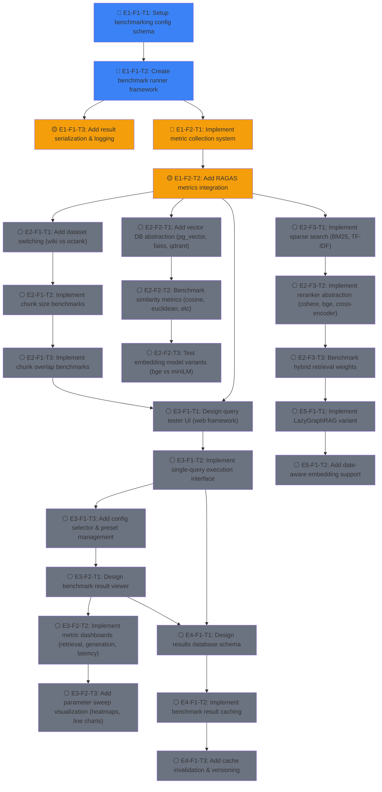

# EvenementsRAG Roadmap

## Project Overview

EvenementsRAG is a progressive RAG benchmarking system for historical events (WW2), designed to systematically evaluate and compare different RAG techniques, retrieval parameters, and generation configurations. The project has successfully implemented a hybrid RAG baseline with 10k Wikipedia articles and is expanding into comprehensive benchmarking infrastructure with parameterized evaluation and visualization.

**Current State**: Phase 1 baseline (vanilla RAG) and Phase 2 (hybrid RAG + temporal) evaluated on 49 articles. Phase 3 infrastructure (parametrized benchmarking) in planning. Goal: Build a complete benchmarking framework with UI to test arbitrary configurations and visualize results.

---

## Dependency Graph

---

## Epics & Tasks

### 🏗 E1: Core Benchmarking Infrastructure

The foundation for parameterized evaluation. Establishes config management, metric collection, and result logging.

#### E1-F1: Benchmark Configuration & Execution

##### 🔵 E1-F1-T1: Setup benchmarking config schema
- blocked_by: []
- status: ready
- effort: M
- agent_hint: Create YAML/Pydantic schema for benchmark config (dataset, vector_db, chunk_size, embeddings, rag_technique, reranker, generation_params). Should support presets and CLI override.
- description: Define the configuration structure for parameterized benchmarks. Must support all parameters from benchmark.md (retrieval params, generation params, metrics config). Create Pydantic BaseModel for validation and serialization.

##### 🔵 E1-F1-T2: Create benchmark runner framework
- blocked_by: [E1-F1-T1]
- status: ready
- effort: L
- agent_hint: Implement BenchmarkRunner class that takes a config, initializes the RAG pipeline, runs queries, collects results in standardized format. Should be composable and support batching.
- description: Build the main benchmarking orchestrator. Takes a config, sets up the RAG system, executes evaluation questions, and returns structured results (retrieval metrics, generation metrics, latency). Must be reusable across different phases.

##### 🟡 E1-F1-T3: Add result serialization & logging
- blocked_by: [E1-F1-T2]
- status: in_progress
- effort: S
- agent_hint: Save benchmark results to JSON with timestamp, config, all metrics. Add structured logging with timestamps and config hashing for traceability.
- description: Implement JSON serialization for benchmark results with config, timestamps, and result metadata. Add logging to track benchmark execution.

#### E1-F2: Metric Collection & Evaluation

##### 🔵 E1-F2-T1: Implement metric collection system
- blocked_by: [E1-F1-T2]
- status: ready
- effort: M
- agent_hint: Create MetricsCollector class that computes retrieval metrics (Hit@K, MRR, NDCG), generation metrics (ROUGE, BERTScore), and latency metrics. Should be modular per metric type.
- description: Build a unified metrics collection system supporting all metrics from benchmark.md: retrieval (Article Hit@K, Chunk Hit@K, MRR), generation (ROUGE-L, BERTScore), and latency (p95, p99).

##### 🟡 E1-F2-T2: Add RAGAS metrics integration
- blocked_by: [E1-F2-T1]
- status: in_progress
- effort: L
- agent_hint: Integrate RAGAS library for faithfulness, answer_relevancy, context_precision, context_recall, context_entity_recall, answer_similarity, answer_correctness, harmfulness, maliciousness, coherence, correctness, conciseness. Handle LLM-based metrics with caching.
- description: Integrate RAGAS metrics for generation quality. All 11+ RAGAS metrics from benchmark.md must be collected. Must handle API rate limiting and result caching.

---

### 📊 E2: Parameter Benchmarking System

Implements parameterized testing across all dimensions: datasets, vector DBs, chunk configs, embeddings, RAG techniques, rerankers, and generation params.

#### E2-F1: Dataset & Preprocessing Parameters

##### ⚪ E2-F1-T1: Add dataset switching (wiki vs octank)
- blocked_by: [E1-F2-T2]
- status: pending
- effort: M
- agent_hint: Abstract dataset source via DatasetManager. Implement loaders for: (1) Wikipedia 10k articles, (2) OctankFinancial dataset. Support config-driven switching.
- description: Implement dataset abstraction to benchmark against multiple sources (Wikipedia WW2 vs OctankFinancial). Must support loading, caching, and easy switching via config.

##### ⚪ E2-F1-T2: Implement chunk size benchmarks
- blocked_by: [E2-F1-T1]
- status: pending
- effort: S
- agent_hint: Parametrize chunk_size in preprocessing. Re-chunk articles with sizes: 256, 512, 1024. Track chunking overhead and quality impact.
- description: Enable benchmarking chunk sizes (256, 512, 1024 tokens). Must re-chunk datasets dynamically based on config and track impact on retrieval quality.

##### ⚪ E2-F1-T3: Implement chunk overlap benchmarks
- blocked_by: [E2-F1-T2]
- status: pending
- effort: S
- agent_hint: Add chunk_overlap parameter to preprocessor. Test with overlap values: 0, 50, 128, 256. Track quality vs storage trade-off.
- description: Benchmark chunk overlap values (0, 50, 128, 256). Must support dynamic re-chunking and measure impact on retrieval precision.

#### E2-F2: Vector Database & Similarity Metrics

##### ⚪ E2-F2-T1: Add vector DB abstraction (pg_vector, faiss, qdrant)
- blocked_by: [E1-F2-T2]
- status: pending
- effort: L
- agent_hint: Create VectorStoreFactory with support for: (1) Qdrant (in-memory & server), (2) FAISS (file-based), (3) pgvector (PostgreSQL). Implement common interface for search, indexing, filtering.
- description: Implement abstraction layer for vector databases (Qdrant, FAISS, pgvector). Must support indexing, search, filtering, and latency measurement per DB backend.

##### ⚪ E2-F2-T2: Benchmark similarity metrics (cosine, euclidean, dot_product, manhattan, ANN)
- blocked_by: [E2-F2-T1]
- status: pending
- effort: M
- agent_hint: Add similarity_metric parameter to vector store. Benchmark: cosine, euclidean, dot_product, manhattan, and ANN variants. Measure retrieval quality and latency per metric.
- description: Test different similarity metrics (cosine, euclidean, dot product, manhattan, ANN methods). Must collect both quality and latency metrics per similarity approach.

##### ⚪ E2-F2-T3: Test embedding model variants (bge vs miniLM)
- blocked_by: [E2-F2-T2]
- status: pending
- effort: M
- agent_hint: Create EmbeddingFactory supporting: (1) bge-base (BAAI), (2) all-MiniLM-L12 (current), others as expandable. Re-embed articles and benchmark retrieval quality.
- description: Benchmark embedding models: bge-base, all-MiniLM-L6-v2, all-MiniLM-L12. Measure retrieval quality and embedding computation overhead per model.

#### E2-F3: Retrieval Techniques & Reranking

##### ⚪ E2-F3-T1: Implement sparse search (BM25, TF-IDF)
- blocked_by: [E1-F2-T2]
- status: pending
- effort: M
- agent_hint: Extend retriever to support: (1) Pure BM25, (2) Pure TF-IDF, (3) Combined w/ dense. Support configurable parameters (k1, b for BM25). Benchmark vs dense retrieval.
- description: Implement sparse retrieval methods (BM25, TF-IDF) as alternatives/supplements to dense retrieval. Must support standalone and hybrid configurations.

##### ⚪ E2-F3-T2: Implement reranker abstraction (cohere, bge, cross-encoder)
- blocked_by: [E2-F3-T1]
- status: pending
- effort: M
- agent_hint: Create RerankerFactory with: (1) No reranker, (2) Cohere v3, (3) bge-reranker-v2, (4) cross-encoder. Measure reranking latency and quality impact.
- description: Implement reranker abstraction supporting multiple backends (none, Cohere, BGE, cross-encoder). Measure quality improvement and latency cost.

##### ⚪ E2-F3-T3: Benchmark hybrid retrieval weights
- blocked_by: [E2-F3-T2]
- status: pending
- effort: M
- agent_hint: Add hybrid_weight parameter. Test BM25 weights: 0% (pure dense), 10%, 15%, 20%, 30%, 50%. Track quality impact of hybrid fusion method (RRF, weighted sum, etc).
- description: Benchmark hybrid retrieval with different BM25/dense weight combinations (0%, 10%, 15%, 20%, 30%, 50%). Test RRF, weighted sum, and other fusion methods.

#### E2-F4: Generation Parameters

##### ⚪ E2-F4-T1: Parametrize generation settings
- blocked_by: [E1-F2-T2]
- status: pending
- effort: M
- agent_hint: Add top_k_chunks, top_k_articles, llm_model, prompt_template to config. Support LLM model switching (free OpenRouter models). Benchmark generation quality & latency.
- description: Make generation configurable: top_k_chunks, top_k_articles, LLM model selection, prompt templates. Measure impact on answer quality and latency.

---

### 🎨 E3: UI & Visualization Layer

Web interface for testing individual queries and visualizing benchmark results.

#### E3-F1: Query Tester Interface

##### ⚪ E3-F1-T1: Design query tester UI (web framework)
- blocked_by: [E1-F1-T3, E1-F2-T2]
- status: pending
- effort: L
- agent_hint: Choose web framework (FastAPI + React, or Streamlit). Design single-page app with: config selector, query input, live execution, result display showing retrieval + generation steps. Reference benchmark.md UI spec.
- description: Build interactive query testing UI. User can select config preset, enter query, execute, and see detailed retrieval and generation results with latency breakdown.

##### ⚪ E3-F1-T2: Implement single-query execution interface
- blocked_by: [E3-F1-T1]
- status: pending
- effort: M
- agent_hint: Implement backend endpoint for single query execution with specific config. Return: retrieved chunks, reranked order, generation result, latency breakdown, all metrics.
- description: Implement query execution API endpoint. Takes query + config, returns full trace of retrieval, ranking, and generation steps.

##### ⚪ E3-F1-T3: Add config selector & preset management
- blocked_by: [E3-F1-T2]
- status: pending
- effort: S
- agent_hint: UI component for config selection (presets: Phase1, Phase2, Phase3+variants). Allow quick switching between common configs, display current settings, allow one-off parameter override.
- description: Add UI for config management. Support preset configs (Phase1, Phase2, Phase3 variants) with quick switching and parameter overrides.

#### E3-F2: Benchmark Results Viewer

##### ⚪ E3-F2-T1: Design benchmark result viewer
- blocked_by: [E3-F1-T1]
- status: pending
- effort: M
- agent_hint: Design dashboard showing: config used, all retrieval metrics (Hit@K, MRR), all generation metrics (ROUGE, BERTScore, RAGAS), latency percentiles. Support filtering/searching results.
- description: Build results dashboard showing all computed metrics for a benchmark run, with filters for config parameters and result sorting.

##### ⚪ E3-F2-T2: Implement metric dashboards (retrieval, generation, latency)
- blocked_by: [E3-F2-T1]
- status: pending
- effort: M
- agent_hint: Create tab-based view: (1) Retrieval metrics table, (2) Generation metrics table, (3) Latency distribution (box plot p95/p99). Support export to CSV.
- description: Implement detailed metric views by category (retrieval, generation, latency) with tabular display and basic visualizations.

##### ⚪ E3-F2-T3: Add parameter sweep visualization (heatmaps, line charts)
- blocked_by: [E3-F2-T2]
- status: pending
- effort: L
- agent_hint: Create multi-result analyzer. User fixes all params except one (e.g., chunk_size), view quality change as line chart. Support 2D heatmaps for two varying params. Use Plotly for interactivity.
- description: Visualization for parameter sensitivity analysis. Line charts for single-param sweeps, heatmaps for two-param comparisons. Show how metrics vary with parameter changes.

---

### 💾 E4: Results Caching & Database

Persistent storage for benchmark results with intelligent caching.

#### E4-F1: Result Storage & Caching

##### ⚪ E4-F1-T1: Design results database schema
- blocked_by: [E3-F1-T2, E3-F2-T1]
- status: pending
- effort: S
- agent_hint: Design normalized schema: (1) Benchmark runs table (config hash, timestamp, status), (2) Metric results (run_id, metric_name, value), (3) Query results (run_id, query, chunks_retrieved, generation_result). Support versioning.
- description: Design database schema for storing benchmark runs, metrics, and query results with versioning and traceability.

##### ⚪ E4-F1-T2: Implement benchmark result caching
- blocked_by: [E4-F1-T1]
- status: pending
- effort: M
- agent_hint: Implement ResultCache: (1) Config hashing (deterministic hash of all params), (2) Check if config already evaluated, (3) Return cached results if available, (4) Compute new results otherwise. Support both file and DB backends.
- description: Implement caching layer. When benchmarking a config, check if already computed and return cached results. Support both file and database backends.

##### ⚪ E4-F1-T3: Add cache invalidation & versioning
- blocked_by: [E4-F1-T2]
- status: pending
- effort: S
- agent_hint: Implement version tracking for codebase and dataset. Cache entries tagged with code version + dataset version. Clear cache on data/code changes. Support manual cache busting.
- description: Track cache validity via code and dataset versions. Implement cache invalidation on significant changes (code updates, dataset refreshes).

---

### 🚀 E5: Advanced RAG Techniques

Later-phase implementations for advanced retrieval methods.

#### E5-F1: Advanced RAG Methods

##### ⚪ E5-F1-T1: Implement LazyGraphRAG variant
- blocked_by: [E2-F3-T3]
- status: pending
- effort: L
- agent_hint: Implement lightweight graph-based retrieval without full Neo4j. Extract entities/relationships from chunks, build lightweight graph, support path-based retrieval. Benchmark vs hybrid.
- description: Implement a simplified graph RAG approach using entity/relationship extraction without full knowledge graph infrastructure. Benchmark against hybrid retrieval.

##### ⚪ E5-F1-T2: Add date-aware embedding support
- blocked_by: [E5-F1-T1]
- status: pending
- effort: M
- agent_hint: Experiment with temporal embeddings: (1) Concatenate temporal metadata to embeddings, (2) Learn temporal offset adjustments, (3) Time-weighted similarity. Benchmark on temporal questions.
- description: Implement date-aware embeddings that incorporate temporal metadata. Measure improvement on temporal question types.

---

## Critical Path

🔴 **E1-F1-T1 → E1-F1-T2 → E1-F1-T3 → E1-F2-T1 → E1-F2-T2 → E2-F1-T1 → E2-F1-T2 → E2-F1-T3 → E3-F1-T1 → E3-F1-T2 → E3-F1-T3 → E3-F2-T1 → E3-F2-T2 → E3-F2-T3**

**Length**: 14 tasks (critical blocking path)

This is the path to a complete benchmarking + visualization system. Shorter paths exist for partial functionality (e.g., just CLI benchmarking without UI).

---

## Parallel Opportunities

⚡ **Parallel Group A** (after E1-F2-T2):
- E2-F1-T1, E2-F2-T1, E2-F3-T1, E2-F4-T1 can all start independently
- **Benefit**: Build out all parameter dimensions in parallel before merging for UI

⚡ **Parallel Group B** (after E3-F1-T1):
- E3-F1-T2 and E3-F2-T1 can design/implement in parallel
- **Benefit**: Query tester and results viewer are independent components

⚡ **Parallel Group C** (after E2-F3-T3):
- E4-F1-T1, E5-F1-T1 can start (storage design and advanced RAG don't block each other)
- **Benefit**: Database schema and advanced methods developed in parallel

---

## Done

✅ **Phase 0 – Foundation** (completed)
- Project structure established
- Configuration management (config/settings.py)
- Question taxonomy (docs/question_types_taxonomy.md)
- Qdrant setup (scripts/setup_qdrant.sh)

✅ **Data Ingestion – 10k Articles** (completed)
- Wikipedia scraper (scripts/scrape_10k_articles.py) — fetches 10k+ articles
- Article indexing (src/preprocessing/, src/vector_store/)
- Metadata extraction (categories, links, word counts)

✅ **Phase 1 – Vanilla RAG** (completed)
- Embedding generation (sentence-transformers/all-MiniLM-L6-v2)
- Qdrant indexing (1849 chunks from 49 articles)
- Baseline evaluation (50 questions, retrieval + generation metrics)
- Phase1 vs Phase2 comparison (CHANGELOG.md results)

✅ **Phase 2 – Hybrid RAG + Temporal** (completed)
- BM25 sparse search (rank-bm25 integration)
- RRF fusion (Reciprocal Rank Fusion with k=60)
- Temporal extraction & filtering (year/timeframe patterns)
- Evaluation framework (chunk-based ground truth, Hit@K metrics)

✅ **Phase 3 – Evaluation Infrastructure** (in progress)
- Question generation (200 eval questions, chunk-based)
- Metrics collection (Article Hit@K, Chunk Hit@K, MRR, ROUGE, BERTScore)
- Evaluation harness (run_evaluation.py, benchmark runner)

---

## Summary

| Metric | Value |
|--------|-------|
| **Total Tasks** | 33 |
| **Ready (no blockers)** | 5 (E1-F1-T1, E1-F1-T2, E1-F2-T1, E2-F1-T1, E2-F4-T1) |
| **In Progress** | 3 (E1-F1-T3, E1-F2-T2, misc.) |
| **Pending** | 25 |
| **Critical Path Length** | 14 sequential tasks |
| **Parallel Groups** | 3 major opportunities (A: params, B: UI, C: storage/advanced) |

**Next Immediate Steps** (Ready to start):
1. E1-F1-T1: Define benchmark config schema (foundation for all else)
2. E1-F1-T2: Build BenchmarkRunner class (orchestrates everything)
3. E1-F1-T3: Finalize result serialization (enables caching later)
4. E1-F2-T1: Metric collection system (outputs all numbers)
5. E1-F2-T2: RAGAS integration (last piece of core metrics)

Then proceed to **Parallel Group A** (E2 parameters) while E1 is being finalized.

---

## Notes

- Tasks marked 🔵 are **ready** (no dependencies blocking them)
- Tasks marked 🟡 are **in_progress** (partial completion, mergeable)
- Tasks marked ⚪ are **pending** (waiting on dependencies)
- All tasks have explicit `blocked_by` lists for dependency tracking
- Database schema (E4-F1-T1) waits until UI components exist to avoid designing for unknown needs
- Dataset abstraction (E2-F1-T1) can start once metrics collection is solid
- LazyGraphRAG (E5-F1-T1) deferred until hybrid retrieval is fully benchmarked
