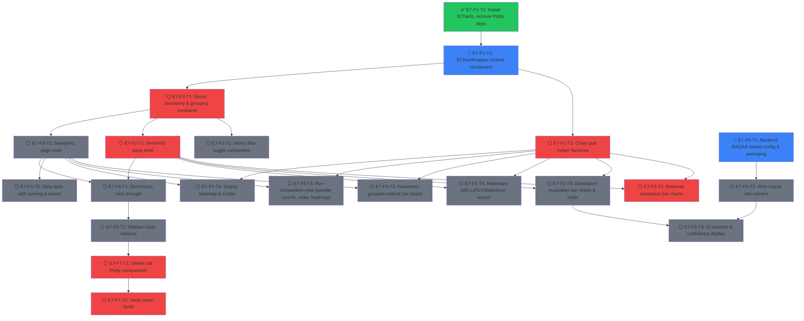

# Roadmap: Evaluation Visualization Overhaul

## Overview

Rebuild the bench and sweep visualization stack from scratch. Replace Plotly.js with Apache ECharts-for-React, restructure metric display into Retrieval Evaluation and Generation Evaluation sections (RAGAS-centric), add multi-run LLM metric stabilization, proper sweep visualization with parameter grouping and run comparison, and click-through navigation from RunHistory.

**Current State**: Existing visualization uses Plotly.js across MetricDashboards, BenchmarkViewer, and individual metric tabs. E3-F2-T3 (parameter sweep visualization) is `ready` but not started. This epic supersedes E3-F2-T3 with a complete rewrite.

**Target State**: ECharts-powered BenchViz and SweepViz pages accessible from RunHistory click-through. Retrieval and Generation evaluation sections with filterable metric bars, radar charts, heatmaps (with LaTeX/Markdown export), parallel coordinates, and run comparison views. Optional multi-run RAGAS averaging for result stabilization.

---

## Dependency Graph

**Legend**: 🔴 `#ef4444` = critical path, 🟡 `#f59e0b` = in_progress, 🟢 `#22c55e` = done, ⚪ `#6b7280` = blocked/pending, 🔵 `#3b82f6` = ready

---

## Epics & Tasks

### 📊 E7: Evaluation Visualization Overhaul

Complete rebuild of bench/sweep visualization using Apache ECharts-for-React, RAGAS-centric metric grouping, and multi-run LLM stabilization.

#### E7-F1: ECharts Infrastructure

##### ✅ E7-F1-T1: Install ECharts dependencies and remove Plotly
- blocked_by: []
- status: done
- effort: S
- agent_hint: In `frontend/`, run `npm install echarts echarts-for-react` and `npm uninstall react-plotly.js plotly.js-dist-min @types/react-plotly.js`. Verify package.json is clean. Build will break on old Plotly imports — that is expected and resolved in F7.
- description: Swap charting library dependencies. Remove react-plotly.js, plotly.js-dist-min, @types/react-plotly.js. Install echarts and echarts-for-react.

##### 🔵 E7-F1-T2: Create EChartWrapper shared component
- blocked_by: [E7-F1-T1]
- status: ready
- effort: M
- agent_hint: Create `frontend/src/components/charts/EChartWrapper.tsx`. Props: `option: EChartsOption`, `height?: number | string` (default 350), `loading?: boolean`, `onEvents?: Record<string, Function>`, `className?: string`. Internally use `ReactECharts` from `echarts-for-react` with `opts={{ renderer: "svg" }}`. Register a custom ECharts theme matching project's slate/blue palette: axis lines `#e2e8f0`, grid `#f1f5f9`, label color `#64748b`, title color `#334155`, series palette `["#3b82f6","#6366f1","#10b981","#f59e0b","#ef4444","#8b5cf6","#14b8a6","#ec4899","#f97316","#0ea5e9"]`. Add loading skeleton overlay. Create barrel export `frontend/src/components/charts/index.ts`.
- description: Reusable ECharts wrapper with project-consistent theming, SVG rendering, responsive resize, and loading state. Foundation for all new visualizations.

##### 🔴 E7-F1-T3: Create chart type helper factories
- blocked_by: [E7-F1-T2]
- status: pending
- effort: M
- agent_hint: Create `frontend/src/components/charts/chartBuilders.ts`. Export factory functions returning `EChartsOption` objects: (1) `buildBarChart({ categories, series, yAxisFormat?, title?, horizontal? })` — grouped/stacked bar. (2) `buildRadarChart({ indicators, series })` — radar/spider. (3) `buildHeatmapChart({ xData, yData, data, min?, max?, title? })` — heatmap with red-to-green gradient. (4) `buildParallelChart({ dimensions, data, colors? })` — parallel coordinates. (5) `buildBoxplotChart({ categories, data, title? })` — box plot for latency. Include `colorScale(value, min, max, higherIsBetter)`, `formatMetricValue(key, value)`, and `metricDisplayName(key)` utilities.
- description: Chart option factory functions for bar, radar, heatmap, parallel coordinates, and boxplot. Centralizes ECharts config so pages only supply data.

---

#### E7-F2: Shared Metric Grouping Utilities

##### 🔴 E7-F2-T1: Create metric taxonomy and grouping constants
- blocked_by: [E7-F1-T2]
- status: pending
- effort: S
- agent_hint: Create `frontend/src/constants/metricGroups.ts`. Define two top-level groups: (1) `RETRIEVAL_METRICS` with sub-groups: Document-Level (Doc P@5, Doc MRR, Doc R@5), Chunk-Level (MRR, R@5, R@10, Chunk P@5), Context/LLM (Context Precision, Context Recall, Context Relevance), Entity/NER (Ent P@5, Ent R@5, Ent MRR). (2) `GENERATION_METRICS` with sub-groups: Faithfulness, Answer Relevancy, Factual Correctness (answer_correctness + answer_similarity), Quality (coherence, correctness, conciseness), Safety (harmfulness, maliciousness — higherIsBetter: false). Export `ALL_METRIC_KEYS`, `HIGHER_IS_BETTER: Record<string, boolean>`, and `getMetricValue(result, key)` helper.
- description: Central metric taxonomy defining Retrieval and Generation evaluation groups with sub-categories. Maps metric keys to display names, direction, and provides extraction helpers. Single source of truth for all visualization pages.

##### ⚪ E7-F2-T2: Create metric filter toggle component
- blocked_by: [E7-F2-T1]
- status: pending
- effort: S
- agent_hint: Create `frontend/src/components/charts/MetricFilterBar.tsx`. Props: `metricGroups`, `activeMetrics: Set<string>`, `onToggle`, `onToggleAll`. Renders metric names as clickable pill buttons grouped by category. Active = `bg-blue-100 text-blue-700 border-blue-200`, inactive = `bg-gray-50 text-gray-400 border-gray-200 line-through`. Group headers clickable to toggle entire group. Show "N/M metrics selected" count.
- description: Clickable metric filter bar toggling individual metrics or entire groups. Reused on both BenchViz and SweepViz pages.

---

#### E7-F3: Bench Visualization Page

##### 🔴 E7-F3-T1: BenchViz page shell with data loading
- blocked_by: [E7-F2-T1]
- status: pending
- effort: M
- agent_hint: Create `frontend/src/pages/BenchViz.tsx`. Route: `/bench-viz/:filename` (URL-encoded). Load result via `getResult(decodeURIComponent(filename))`. State: `result`, `loading`, `error`, `activeRetrievalMetrics`, `activeGenerationMetrics` (all on by default). Layout: `PageHeader` with result name + timestamp + config badges. Two vertical sections with `<h2>` headers: "Retrieval Evaluation" and "Generation Evaluation", each with a `MetricFilterBar`. Add route in `App.tsx`.
- description: Bench visualization page shell. Loads single benchmark result, renders vertically-stacked Retrieval and Generation sections with metric filter bars.

##### 🔴 E7-F3-T2: Retrieval evaluation bar charts
- blocked_by: [E7-F3-T1, E7-F1-T3]
- status: pending
- effort: M
- agent_hint: Create `frontend/src/components/viz/RetrievalBarCharts.tsx`. Props: `result`, `activeMetrics`. (1) "Retrieval Metrics Overview" — one bar per active retrieval metric showing aggregate average. (2) "Metrics by Question Type" — grouped bars, X-axis = question types, bars = active retrieval metrics. Use `buildBarChart()`. (3) Precision Tiers summary cards (Doc/Chunk/Context/Entity) as compact stat cards above charts.
- description: Retrieval evaluation bar charts: aggregate overview + per-question-type grouped chart + precision tier cards. All filterable.

##### ⚪ E7-F3-T3: Generation evaluation bar charts and radar
- blocked_by: [E7-F3-T1, E7-F1-T3]
- status: pending
- effort: M
- agent_hint: Create `frontend/src/components/viz/GenerationBarCharts.tsx`. Props: `result`, `activeMetrics`. Requires `metrics_summary.ragas`. (1) "Generation Metrics Overview" bar chart with RAGAS averages, color by value (green >= 0.7, amber >= 0.4, red < 0.4). (2) "Quality Fingerprint" radar chart via `buildRadarChart()`. (3) Collapsible per-question RAGAS table with sortable columns, color-coded cells, CSV export. Show placeholder if no RAGAS data.
- description: Generation evaluation: RAGAS bar chart, radar fingerprint, per-question detail table. Filterable. Graceful handling of missing RAGAS data.

##### ⚪ E7-F3-T4: Heatmaps with LaTeX/Markdown export
- blocked_by: [E7-F3-T1, E7-F1-T3]
- status: pending
- effort: M
- agent_hint: Create `frontend/src/components/viz/BenchHeatmap.tsx`. Props: `result`, `activeRetrievalMetrics`, `activeGenerationMetrics`. (1) Per-question heatmap: rows = questions, columns = active metrics, cell color via `colorScale()`. Use `buildHeatmapChart()` + ECharts toolbox save-as-image. (2) Export buttons: "Export LaTeX" (generates `\begin{tabular}` with `\cellcolor`), "Export Markdown" (GitHub-flavored table). Both use `navigator.clipboard.writeText()` with toast. Create `frontend/src/utils/tableExport.ts` with `exportAsLatex()` and `exportAsMarkdown()`. (3) Latency box plot via `buildBoxplotChart()`.
- description: Per-question heatmap with all active metrics. LaTeX and Markdown export for academic use. Latency box plot.

---

#### E7-F4: Sweep Visualization Page

##### ⚪ E7-F4-T1: SweepViz page shell with multi-result loading
- blocked_by: [E7-F2-T1]
- status: pending
- effort: M
- agent_hint: Create `frontend/src/pages/SweepViz.tsx`. Route: `/sweep-viz/:sweepId`. Load sweep meta from `getResultFiles()`, extract child filenames, batch-fetch all children via `Promise.all()`. State: `sweepMeta`, `childResults[]`, `loading`, `error`, `activeView: "parameters" | "comparison"`. Layout: `PageHeader` + segmented toggle for "By Parameter" / "By Run" views. Collapsible filter panel showing parameter values as clickable pills. Add route in `App.tsx`.
- description: Sweep visualization page loading all child results. Two view modes: parameter-grouped and run comparison. Filter panel for narrowing configs.

##### ⚪ E7-F4-T2: Parameter-grouped vertical bar charts
- blocked_by: [E7-F4-T1, E7-F1-T3]
- status: pending
- effort: L
- agent_hint: Create `frontend/src/components/viz/SweepParameterCharts.tsx`. Props: `configs[]`, `sweptParams`, `activeMetrics`, `filters`. Inspired by `rag_sweep_bench (1).jsx` BarView but ALL rendered vertically (no dropdown). For each swept parameter key: section header, then for each active metric a grouped bar chart (X = param values, grouped by other varying params). Use `smartLabel` approach for bar labels showing only varying params. Sections split into "Retrieval Evaluation" and "Generation Evaluation".
- description: Per-parameter grouped bar charts rendered vertically. Inspired by rag_sweep_bench but all visible at once. Grouping by secondary parameters for multi-dimensional sweeps.

##### ⚪ E7-F4-T3: Run comparison view (all-metrics)
- blocked_by: [E7-F4-T1, E7-F1-T3]
- status: pending
- effort: L
- agent_hint: Create `frontend/src/components/viz/SweepRunComparison.tsx`. Inspired by `rag_sweep_all_metrics.jsx`. (1) `normalizeConfigs()` and `smartLabel()` from inspiration. (2) Auto-select view: <=5 configs radar, <=25 parallel coords, >25 heatmap. Manual override pills. (3) Parallel coordinates via `buildParallelChart()`. (4) Radar overlay via `buildRadarChart()` with multiple series. (5) Heatmap matrix sortable by any metric, composite score column. (6) Detail panel on hover/click. (7) "Show top N" slider.
- description: Run comparison from rag_sweep_all_metrics.jsx adapted for ECharts. Parallel coordinates, radar overlay, heatmap matrix with auto-view selection and smart labels.

##### ⚪ E7-F4-T4: Sweep heatmap and scatter
- blocked_by: [E7-F4-T1, E7-F1-T3]
- status: pending
- effort: M
- agent_hint: Create `frontend/src/components/viz/SweepHeatmapScatter.tsx`. (1) Parameter heatmap: user picks X/Y axis params and metric, renders 2D grid via `buildHeatmapChart()`. (2) Scatter plot: X = one metric, Y = another, dots = configs colored by groupBy param. Controls: two dropdowns for axis selection.
- description: Parameter heatmap (2D grid colored by metric) and scatter plot (metric-vs-metric). For analyzing parameter interactions and tradeoffs.

##### ⚪ E7-F4-T5: Data table with ranking and export
- blocked_by: [E7-F4-T1]
- status: pending
- effort: M
- agent_hint: Create `frontend/src/components/viz/SweepDataTable.tsx`. Inspired by DataTable from `rag_sweep_bench (1).jsx`. Sortable table: rank, config label (smart label), param values, active metrics. Best/worst highlighted green/red. Export: CSV, LaTeX, Markdown using `tableExport.ts`. Collapsible section, default collapsed when > 20 configs.
- description: Sortable data table with all sweep configs, parameter values, metric scores. Best/worst highlighting, multi-format export.

---

#### E7-F5: Multi-Run LLM Metric Stabilization

##### 🔵 E7-F5-T1: Backend RAGAS repeat config and averaging logic
- blocked_by: []
- status: ready
- effort: M
- agent_hint: (1) In `src/benchmarks/config.py` `EvaluationConfig`, add `ragas_repeat_count: int = Field(1, ge=1, le=10)`. (2) In `src/evaluation/metrics_collector.py` `compute_ragas_metrics()`: when repeat_count > 1, run evaluator N times, compute per-question mean + std for each metric. Store `ragas_metrics` (averaged) and `ragas_metrics_std` on per-question entries. (3) Add `ragas_repeat_count` to types. (4) Unit test in `tests/unit/evaluation/test_ragas_repeat.py`.
- description: Configurable RAGAS repeat count. When > 1, runs LLM evaluation N times and averages per-question scores. Stores mean and standard deviation.

##### ⚪ E7-F5-T2: Wire repeat count into benchmark and sweep runners
- blocked_by: [E7-F5-T1]
- status: pending
- effort: S
- agent_hint: (1) Verify `RagasEvaluator.evaluate()` is idempotent (can be called multiple times). (2) Add `ragas_repeat_count` to SSE `benchmark_started` / `sweep_started` events. (3) Add `ragas_run: {current, total}` to `question_progress` SSE events during repeats. (4) Allow `config_overrides` to set `evaluation.ragas_repeat_count`.
- description: Wire RAGAS repeat count through benchmark/sweep execution. Add repeat progress to SSE events.

##### ⚪ E7-F5-T3: UI controls and confidence display
- blocked_by: [E7-F5-T2, E7-F3-T3]
- status: pending
- effort: M
- agent_hint: (1) In `ParameterModal.tsx` evaluation section, add "RAGAS Repeat Count" number input (1-10, default 1). Visible only when RAGAS metrics enabled. (2) In `GenerationBarCharts.tsx`, add error bars (whiskers) on bar chart when `ragas_metrics_std` available. (3) In per-question table, add "Std" sub-column. (4) In radar chart, show std as shaded band.
- description: UI for RAGAS repeat count config. Confidence interval display: error bars on bars, shaded bands on radar, std columns in tables.

---

#### E7-F6: Navigation Integration

##### ⚪ E7-F6-T1: RunHistory click-through to BenchViz and SweepViz
- blocked_by: [E7-F3-T1, E7-F4-T1]
- status: pending
- effort: S
- agent_hint: In `RunHistoryTable.tsx`: (1) `NormalRow` onClick → `navigate("/bench-viz/" + encodeURIComponent(r.filename))`. (2) `SweepParentRow`: keep expand toggle, add chart icon button → `navigate("/sweep-viz/" + encodeURIComponent(r.sweep_meta.sweep_id))` with `e.stopPropagation()`. (3) `SweepChildRow` onClick → same as NormalRow. (4) Keep `/benchmarks` route as fallback.
- description: Wire RunHistory clicks to new visualization pages. Bench/child rows → BenchViz, sweep parent → SweepViz icon button.

##### ⚪ E7-F6-T2: Sidebar route cleanup
- blocked_by: [E7-F6-T1]
- status: pending
- effort: S
- agent_hint: In `Sidebar.tsx`: simplify "Results" group to just "Run History" (`/runs`). Remove "Result Viewer" and "Metric Dashboards" entries (replaced by contextual BenchViz/SweepViz). In `App.tsx`, keep old routes for backward compat but redirect `/metrics` → `/runs`. `/benchmarks` still works directly.
- description: Simplify sidebar Results section. Visualizations accessed contextually from RunHistory.

---

#### E7-F7: Cleanup

##### 🔴 E7-F7-T1: Delete old Plotly-based visualization components
- blocked_by: [E7-F6-T2]
- status: pending
- effort: M
- agent_hint: Delete: `frontend/src/components/metrics/RetrievalTab.tsx`, `LatencyTab.tsx`, `RagasTab.tsx`, `MetricTabs.tsx`, `frontend/src/components/benchmarks/MetricsByTypeChart.tsx`, `RagasMetricsGrid.tsx`, `frontend/src/pages/MetricDashboards.tsx`, `frontend/src/pages/BenchmarkViewer.tsx`. In `App.tsx`, remove imports, redirect `/benchmarks` and `/metrics` to `/runs`. Clean up dangling imports. Run `npm run build`.
- description: Delete all Plotly-based components and pages. Redirect old routes. Clean dangling imports.

##### 🔴 E7-F7-T2: Verify clean build
- blocked_by: [E7-F7-T1]
- status: pending
- effort: S
- agent_hint: Verify `package.json` has no Plotly references. Run `npm run build`, fix any TypeScript errors. Grep for residual "plotly" or "react-plotly" references in `frontend/src/`. Final clean build with zero errors.
- description: Final verification: no Plotly references, clean TypeScript build.

---

## Critical Path

🔴 E7-F1-T1 → E7-F1-T2 → E7-F1-T3 → E7-F3-T2 (via E7-F2-T1 → E7-F3-T1) → ... → E7-F6-T2 → E7-F7-T1 → E7-F7-T2

**Longest chain**: E7-F1-T1 → E7-F1-T2 → E7-F2-T1 → E7-F3-T1 → E7-F6-T1 → E7-F6-T2 → E7-F7-T1 → E7-F7-T2 (8 sequential tasks)

---

## Parallel Opportunities

⚡ **parallel group: A** — E7-F1-T1 + E7-F5-T1 (both have no blockers, can start immediately)

⚡ **parallel group: B** — E7-F3-T1 + E7-F4-T1 (both need only E7-F2-T1, bench and sweep shells in parallel)

⚡ **parallel group: C** — E7-F3-T2 + E7-F3-T3 + E7-F3-T4 + E7-F4-T2 + E7-F4-T3 + E7-F4-T4 + E7-F4-T5 (all chart components, independent once shells and factories exist)

⚡ **parallel group: D** — E7-F5-T2 + E7-F6-T1 (independent post-shell tasks)

---

## Done

- **E7-F1-T1**: Swapped Plotly.js deps (react-plotly.js, plotly.js-dist-min, @types/react-plotly.js) for Apache ECharts (echarts, echarts-for-react).
