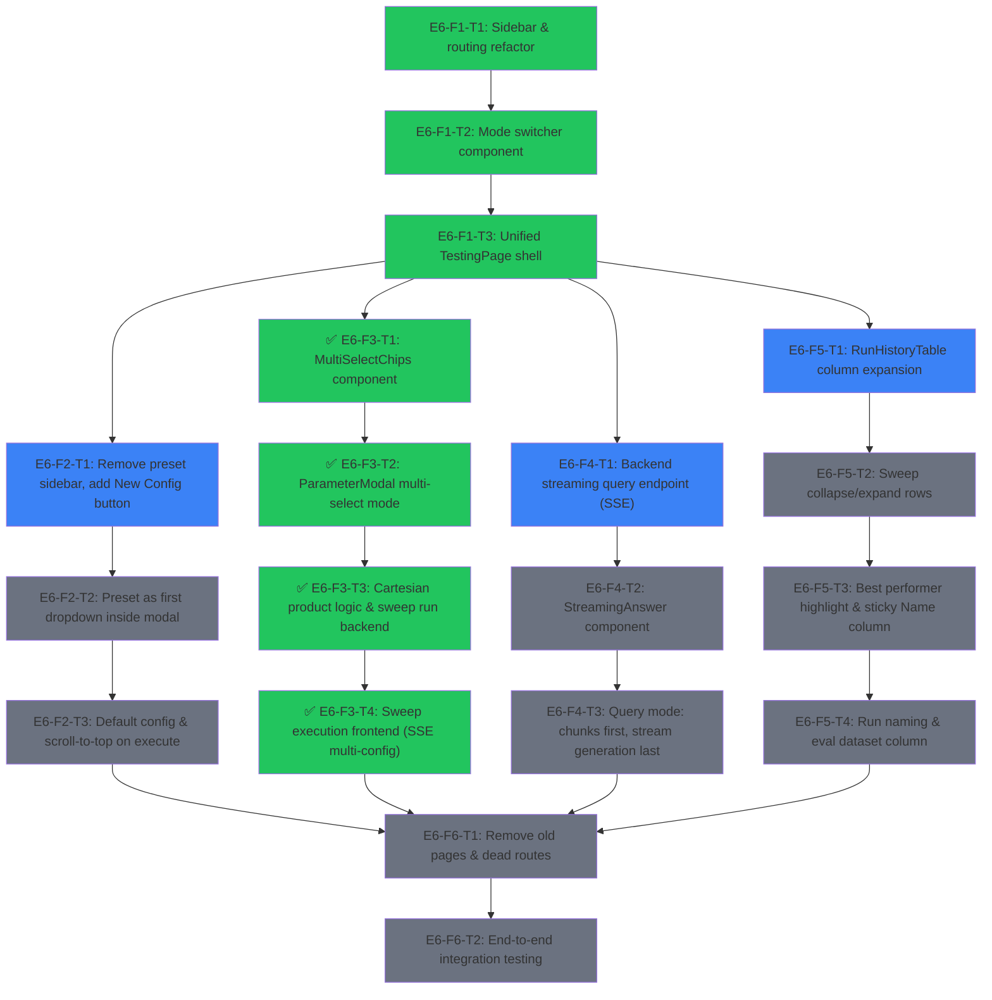

# Roadmap: UI Unification

## Overview

Merge the Query Tester (`/query`), Benchmark Runs (`/runs`), and Sweep Visualizer (`/sweeps`) into a unified **Testing** page with a mode switcher (Query / Benchmark / Sweep). Simplify configuration access, add streaming LLM generation for queries, implement multi-select sweep execution with cartesian product logic, and overhaul the Run History table to serve both benchmarks and sweeps with collapsible sweep rows.

**Current State**: Three separate pages (QueryTester, BenchmarkRuns, SweepVisualizer placeholder) with duplicated config UI. No streaming query generation. No sweep execution. Run History only shows benchmarks.

**Target State**: Single `/testing` page with mode switcher. Config accessed via "New Config" button (presets inside modal). Query mode streams LLM tokens. Sweep mode uses multi-select params with cartesian product backend. Unified Run History table with expandable sweep rows.

---

## Dependency Graph

**Legend**: blue = ready, gray = pending, green = done, amber = in progress

---

## Epics & Tasks

### E6: UI Unification -- Testing Menu

Merge Query, Benchmark, and Sweep interfaces into a single Testing page with shared config, streaming query, multi-select sweep, and unified run history.

#### E6-F1: Layout & Navigation Refactor

##### E6-F1-T1: Sidebar & routing refactor
- blocked_by: []
- status: done
- effort: S
- agent_hint: In `Sidebar.tsx`, replace the three-group NAV_ITEMS with two groups: (1) "Testing" group at top position with single entry `{to: "/testing", label: "Testing"}` and subtitle "Test Query, Benchmarks and Sweeps"; (2) "Data" group unchanged (`/collections`, `/evaluations`). Keep a "Results" group with `/runs` (Run History), `/benchmarks` (Result Viewer), `/metrics` (Metric Dashboards). In `App.tsx`, add route `/testing` pointing to new `TestingPage` component; redirect `/` to `/testing`; keep `/runs`, `/benchmarks`, `/metrics`, `/collections`, `/evaluations` routes. Remove `/query` and `/sweeps` routes; add redirect from `/query` to `/testing` for backward compatibility. Do not yet create TestingPage (use placeholder). Use /frontend skill for design guidance.
- description: Restructure the sidebar navigation and routing. The "Testing" menu becomes the first group, replacing separate Query/Benchmark entries. The Run History table gets its own dedicated route under a "Results" group, separate from the execution interface. Old routes redirect gracefully.

##### E6-F1-T2: Mode switcher component
- blocked_by: [E6-F1-T1]
- status: done
- effort: S
- agent_hint: Create `frontend/src/components/testing/ModeSwitcher.tsx`. Three-way segmented control: Query | Benchmark | Sweep. Props: `mode: "query" | "benchmark" | "sweep"` and `onModeChange: (mode) => void`. Use Tailwind: rounded-lg border, active tab gets `bg-blue-600 text-white`, inactive get `bg-white text-gray-600 hover:bg-gray-50`. Add animated background slide using `transition-all duration-200`. Size: medium, centered horizontally in the page header. Use /frontend skill for design.
- description: Reusable segmented control for switching between the three testing modes. Visually prominent, centered in the page header with smooth animated transition.

##### E6-F1-T3: Unified TestingPage shell
- blocked_by: [E6-F1-T2]
- status: done
- effort: M
- agent_hint: Create `frontend/src/pages/TestingPage.tsx`. State: `mode` ("query" | "benchmark" | "sweep"), config state (baseConfig, overrides), run state. Top section: ModeSwitcher + "New Config" button. Conditionally render three content areas based on mode. Query mode shows query input + results area. Benchmark/Sweep mode shows eval dataset selector + run button + progress. Mode transitions should use CSS `opacity` + `transform` animation: outgoing fades out and slides left while incoming fades in and slides right (`transition-all duration-300`). When switching from Query to Benchmark/Sweep, the chat/results area fades out over 200ms; the benchmark controls fade in after 100ms delay. Alternative elegant solutions for the transition: (A) Crossfade with `opacity` only, (B) Vertical slide with `translateY`, (C) `framer-motion` `AnimatePresence` if available. Use /frontend skill for design.
- description: The main unified Testing page. Contains the mode switcher, shared config state, and conditionally rendered mode panels. Manages transitions between modes with animated crossfade. Orchestrator component that composes all testing subcomponents.

---

#### E6-F2: Simplified Configuration Interface

##### E6-F2-T1: Remove preset sidebar, center the interface
- blocked_by: [E6-F1-T3]
- status: ready
- effort: S
- agent_hint: In TestingPage, use a centered single-column layout (`max-w-3xl mx-auto`) instead of the 4/8 grid split from QueryTester/BenchmarkRuns. Remove `PresetSelector` and `ConfigSummary` from the main page. Replace with a single "New Config" button (`rounded-lg border border-gray-300 bg-white px-4 py-2 text-sm` with gear icon) that opens the ParameterModal. Show a compact config summary badge row below the button (e.g. "wiki_10k | cs512 | MiniLM-L6 | vanilla | Top K 100 | CrossEncoder rerank 20 | Nemotron") using small gray chips for at-a-glance active config. Use /frontend skill for design.
- description: Remove the left-column preset selector and config summary panel. Replace with a single "New Config" button and inline config badge summary. Centers the main content area for a cleaner layout.

##### E6-F2-T2: Preset as first dropdown inside modal
- blocked_by: [E6-F2-T1]
- status: pending
- effort: S
- agent_hint: Modify `ParameterModal.tsx`: add a "Preset" section as the FIRST section (before Dataset). Embed `PresetSelector` dropdown there. When user selects a preset, it loads the config via `getPresetConfig()` and resets all overrides. Add a "Start from scratch" option that loads the default config without preset file. The modal title changes from "Tune Parameters" to "Configure Pipeline". Wire `onPresetChange` callback so TestingPage receives the new baseConfig.
- description: Move preset selection from the main page into the ParameterModal as the first section. Simplifies the main interface while keeping preset functionality accessible. Modal becomes the single entry point for all configuration.

##### E6-F2-T3: Default config & scroll-to-top on execute
- blocked_by: [E6-F2-T2]
- status: pending
- effort: S
- agent_hint: In TestingPage, initialize `baseConfig` by calling `getPresetConfig("default.yaml")` on mount (or fall back to hardcoded defaults). The default must produce collection name `wiki_10k_qdrant_cs512_co128_minilm_l6_cosine` with: `retrieval.top_k=100`, `reranker.type="cross_encoder"`, `reranker.model_name="cross-encoder/ms-marco-MiniLM-L-12-v2"`, `reranker.top_k=20`, `generation.model="nvidia/nemotron-3-nano-30b-a3b"`, `generation.enabled=true`. Create `config/benchmarks/default.yaml` if it does not exist. Also implement scroll-to-top: in handleExecute (all three modes), call `window.scrollTo({top: 0, behavior: 'smooth'})` before starting execution.
- description: Load a sensible default configuration on page mount so users can start testing immediately. Default uses the most common collection parameters. Add scroll-to-top behavior on execution start.

---

#### E6-F3: Sweep Mode (Multi-Select + Cartesian Product)

##### E6-F3-T1: MultiSelectChips component
- blocked_by: [E6-F1-T3]
- status: done
- effort: M
- agent_hint: Create `frontend/src/components/config/MultiSelectChips.tsx`. Similar interface to existing `ParamChips.tsx` but supports multiple selected values. Props: `label: string`, `options: {value, label, disabled?}[]`, `values: T[]` (array), `presetValue: T` (single), `onChange: (values: T[]) => void`. Visual: selected chips get blue border+bg, multiple can be active simultaneously. Add subtle "multi" indicator (stacked-squares icon or "(multi)" label). Clicking selected chip deselects it; clicking unselected adds it. At least one must remain selected (prevent empty). When only one value selected, visually identical to single-select. Use /frontend skill for design.
- description: Multi-select variant of ParamChips for sweep mode. Allows selecting multiple parameter values that form the cartesian product. Clear visual feedback for selected values.

##### E6-F3-T2: ParameterModal multi-select mode
- blocked_by: [E6-F3-T1]
- status: done
- effort: M
- agent_hint: Add `multiSelect?: boolean` prop to `ParameterModal`. When true, replace all `ParamChips` with `MultiSelectChips` for sweepable parameters: chunk_size, chunk_overlap, embedding_model, distance_metric, technique, top_k, reranker_type, reranker_model, rerank_top_k, sparse_weight, sparse_type, fusion_method. Keep generation params (LLM model, temperature, max_tokens, system_prompt) as single-select since spec says "everything except generation". State shape changes: `sweepOverrides: Record<string, unknown[]>` (arrays). Add bottom summary showing "N combinations" computed as cartesian product size. TestingPage opens modal with `multiSelect={true}` when mode is "sweep".
- description: Extend ParameterModal to support multi-select mode for sweep configuration. All sweepable parameters (except generation) use MultiSelectChips. Summary counter shows total parameter combinations.

##### E6-F3-T3: Cartesian product logic & sweep run backend
- blocked_by: [E6-F3-T2]
- status: done
- effort: L
- agent_hint: Backend: Create `src/api/sweep_service.py` modeled after `src/api/benchmark_service.py`. Accepts `SweepRunRequest` with `preset: str`, `sweep_params: dict[str, list[any]]` (e.g. `{"chunking.chunk_size": [256, 512, 1024], "retrieval.top_k": [60, 100]}`), `eval_dataset_id: str`, `name: str` (optional). Compute cartesian product of all sweep_params to get N configs. For each config: ensure collection, run benchmark, yield SSE events. SSE events: `sweep_started` (total_configs, total_questions_per), `config_started` (config_index, config_summary), `config_progress` (config_index, question_index, total_questions), `config_complete` (config_index, metrics), `sweep_complete` (all results). Add `POST /api/benchmark/sweep` endpoint in `src/api/routers/benchmark.py`. Add schemas to `src/api/schemas.py`. Store sweep results: individual result files + `sweep_meta_{hash}_{ts}.json` that lists child filenames and sweep parameters.
- description: Backend service for executing sweep runs. Computes cartesian product of multi-selected parameters, runs each config sequentially, streams progress via SSE. Saves individual results plus sweep metadata linking them.

##### E6-F3-T4: Sweep execution frontend (SSE multi-config)
- blocked_by: [E6-F3-T3]
- status: done
- effort: M
- agent_hint: In `frontend/src/api/client.ts`, add `runSweep(request, callbacks)` function following the same SSE pattern as `runBenchmark()`. Callbacks: `onSweepStarted`, `onConfigStarted`, `onConfigProgress`, `onConfigComplete`, `onSweepComplete`, `onError`. Add corresponding event types and `SweepRunRequest` to `frontend/src/api/types.ts`. In TestingPage, when mode is "sweep" and user clicks "Run Sweep": gather sweepOverrides, call `runSweep()`. Show two-level progress UI: overall progress (config M of N) as top bar + per-config progress (question X of Y) as nested bar. On completion, refresh RunHistoryTable.
- description: Frontend SSE client and UI for sweep execution. Shows two-level progress (configs x questions). Integrates with TestingPage's sweep mode.

---

#### E6-F4: Query Mode Streaming

##### E6-F4-T1: Backend streaming query endpoint (SSE)
- blocked_by: [E6-F1-T3]
- status: ready
- effort: M
- agent_hint: Add `POST /api/query/stream` endpoint in `src/api/routers/query.py`. Reuse `QueryService._get_or_build()` to get the pipeline. Run retrieval synchronously, then stream generation token-by-token via SSE. SSE events: `retrieval_complete` (chunks, retrieval_time_ms), `generation_token` (token: string), `generation_complete` (full_answer, generation_time_ms). For streaming: modify LLM call to use `stream=True` on the OpenAI client (`self.llm_client.chat.completions.create(..., stream=True)`), iterate over chunks, yield each `delta.content` token. Use FastAPI `StreamingResponse` with `media_type="text/event-stream"`. Existing non-streaming `/api/query` remains unchanged.
- description: New SSE endpoint that streams LLM generation tokens in real-time. Retrieval results sent immediately, then generation tokens follow one by one. Frontend can display chunks before generation finishes.

##### E6-F4-T2: StreamingAnswer component
- blocked_by: [E6-F4-T1]
- status: pending
- effort: S
- agent_hint: Create `frontend/src/components/results/StreamingAnswer.tsx`. Props: `tokens: string[]` (accumulated), `isStreaming: boolean`, `error?: string`. Renders accumulated text with blinking cursor at end when `isStreaming=true`. Use `whitespace-pre-wrap` for formatting. When streaming finishes, cursor disappears. Blinking cursor: `` with `animate-pulse` class. Keep it simple -- concatenate tokens and display. Use /frontend skill for design.
- description: Component displaying streaming LLM output with typing indicator. Shows accumulated tokens in real-time with blinking cursor during generation.

##### E6-F4-T3: Query mode: chunks first, stream generation last
- blocked_by: [E6-F4-T2]
- status: pending
- effort: M
- agent_hint: In TestingPage's query mode handler, replace current `executeQuery()` call with new `executeQueryStreaming()` client function that connects to `/api/query/stream`. On `retrieval_complete`: immediately display `ChunkList`, `ChunkScoresChart`, `LatencyBreakdown` (retrieval portion). On `generation_token`: append to `tokens` array state, render `StreamingAnswer` at the BOTTOM (after chunks). On `generation_complete`: finalize answer, update generation_time_ms in LatencyBreakdown. Reorder results section: (1) LatencyBreakdown, (2) ChunkScoresChart, (3) ChunkList, (4) StreamingAnswer. Chunks appear instantly while generation streams below. If generation disabled, skip StreamingAnswer.
- description: Wire streaming into query mode. Chunks display immediately after retrieval, then generation streams token-by-token below them. Generation output moves to last position in results area.

---

#### E6-F5: Run History Table Overhaul

##### E6-F5-T1: RunHistoryTable column expansion
- blocked_by: [E6-F1-T3]
- status: ready
- effort: M
- agent_hint: Overhaul `RunHistoryTable.tsx`. New columns in order: Status (icon), Name (sticky first data column), Type (bench/sweep badge), Timestamp, Dataset, Eval Dataset, Technique, Chunk Size, Chunk Overlap, Embedding Model, Distance Metric, Backend, Top K, Reranker Type, Reranker Model, Rerank Top K, Sparse Weight, Sparse Type, Fusion Method, MRR, R@5, R@10, Time. Name column: `position: sticky; left: 0; z-index: 10` with white background and right shadow. Table container: `overflow-x-auto`. All parameter values: `font-mono text-xs`. Extend backend `GET /api/results` to include chunk_overlap, embedding_model, distance_metric, backend, reranker_type, reranker_model, rerank_top_k, sparse_weight, sparse_type, fusion_method in config_summary. Update `frontend/src/api/types.ts` `ResultFileInfo.config_summary` type.
- description: Expand run history table with all tunable benchmark parameters as columns. Name column sticky on left with horizontal scroll. Backend must expose additional config fields in result summaries.

##### E6-F5-T2: Sweep collapse/expand rows
- blocked_by: [E6-F5-T1]
- status: pending
- effort: L
- agent_hint: Backend `GET /api/results` must return a `sweep_meta` field on `ResultFileInfo` for sweep results containing `{sweep_id, child_filenames: string[], swept_params: Record<string, any[]>}`. A sweep parent row is identified by `sweep_meta != null`. Frontend in RunHistoryTable: detect sweep parents. Render with (1) chevron icon in Name cell rotating on click, (2) swept parameter cells show stacked values (`flex flex-col gap-0.5`, each value on own line), (3) metric cells show "---", (4) subtitle "N configs" under name. Use `useState<Set<string>>` for `expandedSweeps`. When expanded, render child rows with: `bg-gray-50/50` background, sequential index (#1, #2...) in Name cell, full parameter values, actual metric values. Last child row: `border-b-2 border-gray-200`. Follow `inspiration/run_history_feature_spec.md` for full spec.
- description: Implement collapsible sweep rows per run_history_feature_spec.md. Parent rows show stacked values for swept params, dash for metrics, expand to reveal child rows with individual results.

##### E6-F5-T3: Best performer highlight & sticky Name column
- blocked_by: [E6-F5-T2]
- status: pending
- effort: S
- agent_hint: When rendering expanded child rows, compute max MRR among all children. Child with highest MRR gets metric cells (MRR, R@5, R@10, Time) styled with `text-green-600 font-semibold`. If multiple tie, highlight all. Add small green trophy icon next to best child's index. For sticky Name column: ensure `left-0` sticky works with expand/collapse child rows too. Add thin right shadow on sticky column: `shadow-[2px_0_5px_-2px_rgba(0,0,0,0.1)]`. Use /frontend skill for design.
- description: Highlight best-performing child in each sweep by MRR with green styling. Polish sticky Name column with shadow for visual separation during horizontal scroll.

##### E6-F5-T4: Run naming & eval dataset column
- blocked_by: [E6-F5-T3]
- status: pending
- effort: S
- agent_hint: Add "benchmark name" concept. Backend in `BenchmarkService.run_benchmark()`: accept optional `name` field on `BenchmarkRunRequest`. Default = `{collection_name}_{timestamp}` (e.g. `wiki_10k_qdrant_cs512_co128_minilm_l6_cosine_20260321T1430`). Save name in result JSON. Similarly for `SweepRunRequest`. Frontend: add optional name input in TestingPage benchmark/sweep execution area (text input, placeholder: "Run name (optional)"). In RunHistoryTable, display this name in Name column (fall back to collection_name + timestamp). For "Eval Dataset" column: backend includes `eval_dataset_name` in result JSON (resolved from `eval_dataset_id` during run). Update `ResultFileInfo` and types accordingly.
- description: Add user-defined run naming and eval dataset name column. Defaults generate meaningful names from collection + timestamp.

---

#### E6-F6: Cleanup & Integration

##### E6-F6-T1: Remove old pages & dead routes
- blocked_by: [E6-F2-T3, E6-F3-T4, E6-F4-T3, E6-F5-T4]
- status: pending
- effort: S
- agent_hint: Delete `frontend/src/pages/QueryTester.tsx` and `frontend/src/pages/SweepVisualizer.tsx`. BenchmarkRuns page becomes a thin wrapper rendering only `RunHistoryTable` (no config, no run execution -- now in TestingPage). In App.tsx, remove old `/query` and `/sweeps` routes (keep redirects). Clean up unused imports. Remove `getPresets()` calls from anywhere except inside ParameterModal. Verify no dead code referencing old patterns.
- description: Delete obsolete pages and clean up routing. BenchmarkRuns becomes history-only view. All execution moves to TestingPage.

##### E6-F6-T2: End-to-end integration testing
- blocked_by: [E6-F6-T1]
- status: pending
- effort: M
- agent_hint: Manual testing checklist + optional Playwright tests. Verify: (1) Sidebar shows Testing first, navigates to /testing. (2) Mode switcher transitions smoothly. (3) "New Config" opens modal with preset as first section. (4) Default config loads on mount. (5) Query mode: chunks appear first, generation streams below. (6) Benchmark mode: run, progress, result in history. (7) Sweep mode: multi-select, "N configs" count, two-level progress, results in history. (8) Run History: flat benchmark rows, collapsible sweep rows with stacked values, best highlighted green. (9) Horizontal scroll + sticky Name. (10) Old routes redirect. (11) No console errors.
- description: Comprehensive integration testing of the unified interface. Covers all three modes, transitions, run history table, and backward compatibility.

---

## Critical Path

**E6-F1-T1 -> E6-F1-T2 -> E6-F1-T3 -> E6-F3-T1 -> E6-F3-T2 -> E6-F3-T3 -> E6-F3-T4 -> E6-F6-T1 -> E6-F6-T2**

**Length**: 9 tasks (the sweep feature chain is longest due to frontend + backend cartesian product work)

---

## Parallel Opportunities

**Parallel Group A** (after E6-F1-T3 -- once TestingPage shell exists):
- E6-F2-T1 (simplified config) -- independent track
- E6-F3-T1 (multi-select chips) -- independent track
- E6-F4-T1 (streaming backend) -- independent track
- E6-F5-T1 (table columns) -- independent track

All four tracks can proceed in parallel, converging at E6-F6-T1.

**Parallel Group B** (within each feature):
- F2 chain (3 tasks) independent of F3/F4/F5
- F4 chain (3 tasks) independent of F3/F5
- F5 chain (4 tasks) independent of F3/F4

**Effective time**: 3 (F1) + max(3, 4, 3, 4) (parallel tracks) + 2 (F6) = **9 tasks** instead of 19 serial.

---

## Additional Suggested Features

##### E6-F7-T1: Config diff view
- blocked_by: [E6-F2-T1]
- status: pending
- effort: S
- agent_hint: When user modifies the default config, show changed params highlighted in amber in the config badge row. Helps users see what they changed without reopening the modal. Compare current overrides against baseConfig to determine which params differ.
- description: Visual diff showing which parameters were modified from the preset/default. Changed params highlighted in the inline config badge summary.

##### E6-F7-T2: Sweep progress estimation
- blocked_by: [E6-F3-T4]
- status: pending
- effort: S
- agent_hint: Show estimated time remaining for sweep runs based on average completion time of finished configs. Display "~12 min remaining (4/12 configs done)" below the progress bars. Use rolling average of per-config wall time.
- description: Time estimation for sweep runs. Shows remaining time based on average per-config completion time.

##### E6-F7-T3: Run History filtering & search
- blocked_by: [E6-F5-T1]
- status: pending
- effort: M
- agent_hint: Add filter dropdowns above RunHistoryTable: by type (bench/sweep/all), by dataset, by technique. Add text search on run name. Table will get busy with sweep rows, so filtering is essential. Use Tailwind `flex gap-2` row of small dropdowns + search input above the table.
- description: Filter and search for the run history table. Filter by type, dataset, technique. Text search on run name.

##### E6-F7-T4: Keyboard shortcuts
- blocked_by: [E6-F1-T3]
- status: pending
- effort: S
- agent_hint: `Ctrl+Enter` to execute (already exists for query), `Ctrl+1/2/3` to switch modes, `Escape` to cancel running benchmark/sweep. Use `useEffect` with `keydown` listener. Guard against input focus to avoid conflicts.
- description: Keyboard shortcuts for mode switching and execution. Improves power-user workflow.

---

## Effort Summary

| Effort | Count | Tasks |
|--------|-------|-------|
| S      | 9     | F1-T1, F1-T2, F2-T1, F2-T2, F2-T3, F4-T2, F5-T3, F5-T4, F6-T1 |
| M      | 8     | F1-T3, F3-T1, F3-T2, F3-T4, F4-T1, F4-T3, F5-T1, F6-T2 |
| L      | 2     | F3-T3, F5-T2 |
| **Total** | **19** | Core: 17 + Cleanup: 2 |

Suggested features (E6-F7): 4 additional tasks (3S + 1M).

---

## Key Files

| File | Role |
|------|------|
| `frontend/src/components/layout/Sidebar.tsx` | Navigation restructure |
| `frontend/src/pages/TestingPage.tsx` | **New** -- unified testing page |
| `frontend/src/pages/QueryTester.tsx` | To be deleted (merged into TestingPage) |
| `frontend/src/pages/BenchmarkRuns.tsx` | Becomes history-only view |
| `frontend/src/pages/SweepVisualizer.tsx` | To be deleted |
| `frontend/src/components/config/ParameterModal.tsx` | Gains preset section + multi-select mode |
| `frontend/src/components/config/ParamChips.tsx` | Pattern for MultiSelectChips |
| `frontend/src/components/config/MultiSelectChips.tsx` | **New** -- multi-select param chips |
| `frontend/src/components/testing/ModeSwitcher.tsx` | **New** -- Query/Benchmark/Sweep toggle |
| `frontend/src/components/results/StreamingAnswer.tsx` | **New** -- streaming LLM output |
| `frontend/src/components/benchmarks/RunHistoryTable.tsx` | Column expansion + sweep rows |
| `frontend/src/api/client.ts` | New SSE clients (sweep, streaming query) |
| `frontend/src/api/types.ts` | New types for sweep + streaming events |
| `frontend/src/App.tsx` | Route updates |
| `src/api/sweep_service.py` | **New** -- cartesian product sweep backend |
| `src/api/routers/benchmark.py` | New `/api/benchmark/sweep` endpoint |
| `src/api/routers/query.py` | New `/api/query/stream` endpoint |
| `src/api/schemas.py` | Sweep + streaming schemas |
| `config/benchmarks/default.yaml` | **New** -- default preset |
| `inspiration/run_history_feature_spec.md` | Reference spec for sweep row design |

---

## Architecture Decisions

### E6-F1: Layout & Navigation (completed 2026-03-21)
- **Shared config state**: TestingPage owns `preset`, `baseConfig`, `overrides`, `datasets` state once — shared across all three modes. No prop drilling; mode panels render inline.
- **Mode transitions**: Used existing `animate-fade-in-up` CSS animation (0.4s ease-out) for panel entrance. No framer-motion needed. Panels unmount when inactive (no exit animation, but keeps state in parent).
- **Config panel deduplication**: `renderConfigPanel()` local helper renders the identical PresetSelector + Parameters button + ConfigSummary column for both query and benchmark modes.
- **RunHistoryTable stays at /runs**: TestingPage's benchmark mode shows a completion message with Link to `/runs` instead of embedding the table. Keeps the page focused on execution.
- **ParameterModal hideSections**: Computed from current `mode` — query mode shows "Results" section (highlight toggle), benchmark/sweep hides it.
- **Sidebar subtitle**: Added optional `subtitle` field to NavSection for the "Testing" group description.

### E6-F3: Sweep Mode (completed 2026-03-21)
- **Shared overrides state**: Sweep mode reuses the same `overrides` state object as query/benchmark but stores **arrays** for multi-selected params. `extractSweepParams()` splits the overrides into `sweep_params` (arrays with length > 1) and `config_overrides` (scalars, including single-element arrays collapsed to scalars) before sending to backend.
- **CollectionSection replaced in sweep mode**: When `multiSelect=true`, ParameterModal skips the CollectionSection component (import button, derived name, existence badge) and renders direct MultiSelectChips for chunk_size, chunk_overlap, embedding_model, distance_metric. The sweep backend handles collection creation per combination automatically.
- **Generation params stay single-select**: LLM model, temperature, max_tokens, system prompt remain single-select in sweep mode per spec ("everything except generation"). These are passed as scalar `config_overrides`.
- **Cartesian product computed on backend**: Frontend computes only the combination count (for display). Backend's `compute_cartesian_configs()` uses `itertools.product` and auto-resolves `dense_weight = 1 - sparse_weight` and embedding dimension from model name. Invalid combos (e.g., overlap >= chunk_size) are caught by Pydantic validation and skipped with a warning.
- **Per-config error resilience**: If one config in a sweep fails, the sweep continues to the next. `config_complete` events include `status: "ok" | "error"` so the frontend can display partial results.
- **Sweep metadata**: Saved to `results/sweeps/sweep_meta_{hash}_{ts}.json` linking individual result files, enabling future E6-F5 sweep row grouping.
- **SPARSE_WEIGHT_OPTIONS**: Added to `paramOptions.ts` as chips (values: 0.0, 0.1, 0.15, 0.2, 0.3, 0.5) matching `_HYBRID_WEIGHT_SWEEP` in config.py. Replaces the ParamSlider for sparse_weight in sweep mode.
