# Roadmap: UI Unification

## Overview

Merge the Query Tester (`/query`), Benchmark Runs (`/runs`), and Sweep Visualizer (`/sweeps`) into a unified **Testing** page with a mode switcher (Query / Benchmark / Sweep). Simplify configuration access, add streaming LLM generation for queries, implement multi-select sweep execution with cartesian product logic, and overhaul the Run History table to serve both benchmarks and sweeps with collapsible sweep rows.

**Current State**: Three separate pages (QueryTester, BenchmarkRuns, SweepVisualizer placeholder) with duplicated config UI. No streaming query generation. No sweep execution. Run History only shows benchmarks.

**Target State**: Single `/testing` page with mode switcher. Config accessed via "New Config" button (presets inside modal). Query mode streams LLM tokens. Sweep mode uses multi-select params with cartesian product backend. Unified Run History table with expandable sweep rows.

---

## Dependency Graph

```mermaid
graph TD
  E6F1T1["E6-F1-T1: Sidebar & routing refactor"]
  E6F1T2["E6-F1-T2: Mode switcher component"]
  E6F1T3["E6-F1-T3: Unified TestingPage shell"]

  E6F2T1["E6-F2-T1: Remove preset sidebar, add New Config button"]
  E6F2T2["E6-F2-T2: Preset as first dropdown inside modal"]
  E6F2T3["E6-F2-T3: Default config & scroll-to-top on execute"]

  E6F3T1["✅ E6-F3-T1: MultiSelectChips component"]
  E6F3T2["✅ E6-F3-T2: ParameterModal multi-select mode"]
  E6F3T3["✅ E6-F3-T3: Cartesian product logic & sweep run backend"]
  E6F3T4["✅ E6-F3-T4: Sweep execution frontend (SSE multi-config)"]

  E6F4T1["✅ E6-F4-T1: Backend streaming query endpoint (SSE)"]
  E6F4T2["✅ E6-F4-T2: StreamingAnswer component"]
  E6F4T3["✅ E6-F4-T3: Query mode: chunks first, stream generation last"]

  E6F5T1["E6-F5-T1: RunHistoryTable column expansion"]
  E6F5T2["E6-F5-T2: Sweep collapse/expand rows"]
  E6F5T3["E6-F5-T3: Best performer highlight & sticky Name column"]
  E6F5T4["E6-F5-T4: Run naming & eval dataset column"]

  E6F6T1["E6-F6-T1: Remove old pages & dead routes"]
  E6F6T2["E6-F6-T2: End-to-end integration testing"]

  E6F1T1 --> E6F1T2
  E6F1T2 --> E6F1T3

  E6F1T3 --> E6F2T1
  E6F2T1 --> E6F2T2
  E6F2T2 --> E6F2T3

  E6F1T3 --> E6F3T1
  E6F3T1 --> E6F3T2
  E6F3T2 --> E6F3T3
  E6F3T3 --> E6F3T4

  E6F1T3 --> E6F4T1
  E6F4T1 --> E6F4T2
  E6F4T2 --> E6F4T3

  E6F1T3 --> E6F5T1
  E6F5T1 --> E6F5T2
  E6F5T2 --> E6F5T3
  E6F5T3 --> E6F5T4

  E6F2T3 --> E6F6T1
  E6F3T4 --> E6F6T1
  E6F4T3 --> E6F6T1
  E6F5T4 --> E6F6T1
  E6F6T1 --> E6F6T2

  E6F8T1["✅ E6-F8-T1: Doc-ID precision metrics backend"]
  E6F8T2["✅ E6-F8-T2: Wire doc metrics into runner"]
  E6F8T3["✅ E6-F8-T3: LLM Context precision toggle"]
  E6F8T4["✅ E6-F8-T4: Display three-tier metrics in UI"]

  E6F9T1["✅ E6-F9-T1: Unify benchmark/sweep layout"]
  E6F9T2["✅ E6-F9-T2: Extract ExecutionPanel component"]
  E6F9T3["✅ E6-F9-T3: Collection preview list for sweep"]
  E6F9T4["✅ E6-F9-T4: Restrict sweep to doc+LLM metrics"]

  E6F10T1["✅ E6-F10-T1: Multi-select collections in DatasetManager"]
  E6F10T2["✅ E6-F10-T2: System prompt for eval generation"]
  E6F10T3["✅ E6-F10-T3: SSE collection creation in DatasetManager"]

  E6F11T1["✅ E6-F11-T1: Filter eval datasets by collection"]
  E6F11T2["✅ E6-F11-T2: Runtime eval dataset warning"]

  E6F12T1["🔵 E6-F12-T1: Store char offsets in eval dataset"]
  E6F12T2["⚪ E6-F12-T2: Chunk overlap mapping function"]
  E6F12T3["⚪ E6-F12-T3: Wire mapping into benchmark/sweep"]
  E6F12T4["⚪ E6-F12-T4: UI indicator for mapped evaluation"]

  E6F13T1["⚪ E6-F13-T1: Redesign dataset list as table"]
  E6F13T2["🔵 E6-F13-T2: Update dataset naming convention"]
  E6F13T3["⚪ E6-F13-T3: Dataset detail row expansion"]

  E6F14T1["🔵 E6-F14-T1: Add created_at to collection API"]
  E6F14T2["⚪ E6-F14-T2: Creation Time column in CollectionManager"]
  E6F14T3["🔵 E6-F14-T3: Rename Timestamp in RunHistory"]

  E6F15T1["🔵 E6-F15-T1: LLM entity extraction utility"]
  E6F15T2["⚪ E6-F15-T2: Entity precision & recall metrics"]
  E6F15T3["⚪ E6-F15-T3: Wire entity metrics into runner"]
  E6F15T4["⚪ E6-F15-T4: Display entity metrics in UI"]

  E6F8T1 --> E6F8T2
  E6F8T1 --> E6F8T4
  E6F8T3 --> E6F8T4
  E6F8T2 --> E6F8T4

  E6F9T1 --> E6F9T2
  E6F9T1 --> E6F9T3
  E6F8T4 --> E6F9T4
  E6F9T1 --> E6F9T4

  E6F10T1 --> E6F10T3

  E6F11T1 --> E6F11T2

  E6F12T1 --> E6F12T2
  E6F12T2 --> E6F12T3
  E6F12T3 --> E6F12T4

  E6F13T2 --> E6F13T1
  E6F13T1 --> E6F13T3

  E6F14T1 --> E6F14T2

  E6F15T1 --> E6F15T2
  E6F15T2 --> E6F15T3
  E6F15T3 --> E6F15T4

  style E6F1T1 fill:#22c55e
  style E6F1T2 fill:#22c55e
  style E6F1T3 fill:#22c55e
  style E6F2T1 fill:#22c55e
  style E6F2T2 fill:#22c55e
  style E6F2T3 fill:#22c55e
  style E6F3T1 fill:#22c55e
  style E6F3T2 fill:#22c55e
  style E6F3T3 fill:#22c55e
  style E6F3T4 fill:#22c55e
  style E6F4T1 fill:#22c55e
  style E6F4T2 fill:#22c55e
  style E6F4T3 fill:#22c55e
  style E6F5T1 fill:#22c55e
  style E6F5T2 fill:#22c55e
  style E6F5T3 fill:#22c55e
  style E6F5T4 fill:#22c55e
  style E6F6T1 fill:#22c55e
  style E6F6T2 fill:#22c55e
  style E6F8T1 fill:#22c55e
  style E6F8T2 fill:#22c55e
  style E6F8T3 fill:#22c55e
  style E6F8T4 fill:#22c55e
  style E6F9T1 fill:#22c55e
  style E6F9T2 fill:#22c55e
  style E6F9T3 fill:#22c55e
  style E6F9T4 fill:#22c55e
  style E6F10T1 fill:#22c55e
  style E6F10T2 fill:#22c55e
  style E6F10T3 fill:#22c55e
  style E6F11T1 fill:#22c55e
  style E6F11T2 fill:#22c55e
  style E6F12T1 fill:#3b82f6
  style E6F12T2 fill:#6b7280
  style E6F12T3 fill:#6b7280
  style E6F12T4 fill:#6b7280
  style E6F13T1 fill:#6b7280
  style E6F13T2 fill:#3b82f6
  style E6F13T3 fill:#6b7280
  style E6F14T1 fill:#3b82f6
  style E6F14T2 fill:#6b7280
  style E6F14T3 fill:#3b82f6
  style E6F15T1 fill:#3b82f6
  style E6F15T2 fill:#6b7280
  style E6F15T3 fill:#6b7280
  style E6F15T4 fill:#6b7280
```

**Legend**: blue = ready, gray = pending, green = done, amber = in progress

---

## Epics & Tasks

### E6: UI Unification -- Testing Menu

Merge Query, Benchmark, and Sweep interfaces into a single Testing page with shared config, streaming query, multi-select sweep, and unified run history.

#### E6-F1: Layout & Navigation Refactor

##### E6-F1-T1: Sidebar & routing refactor
- blocked_by: []
- status: done
- effort: S
- agent_hint: In `Sidebar.tsx`, replace the three-group NAV_ITEMS with two groups: (1) "Testing" group at top position with single entry `{to: "/testing", label: "Testing"}` and subtitle "Test Query, Benchmarks and Sweeps"; (2) "Data" group unchanged (`/collections`, `/evaluations`). Keep a "Results" group with `/runs` (Run History), `/benchmarks` (Result Viewer), `/metrics` (Metric Dashboards). In `App.tsx`, add route `/testing` pointing to new `TestingPage` component; redirect `/` to `/testing`; keep `/runs`, `/benchmarks`, `/metrics`, `/collections`, `/evaluations` routes. Remove `/query` and `/sweeps` routes; add redirect from `/query` to `/testing` for backward compatibility. Do not yet create TestingPage (use placeholder). Use /frontend skill for design guidance.
- description: Restructure the sidebar navigation and routing. The "Testing" menu becomes the first group, replacing separate Query/Benchmark entries. The Run History table gets its own dedicated route under a "Results" group, separate from the execution interface. Old routes redirect gracefully.

##### E6-F1-T2: Mode switcher component
- blocked_by: [E6-F1-T1]
- status: done
- effort: S
- agent_hint: Create `frontend/src/components/testing/ModeSwitcher.tsx`. Three-way segmented control: Query | Benchmark | Sweep. Props: `mode: "query" | "benchmark" | "sweep"` and `onModeChange: (mode) => void`. Use Tailwind: rounded-lg border, active tab gets `bg-blue-600 text-white`, inactive get `bg-white text-gray-600 hover:bg-gray-50`. Add animated background slide using `transition-all duration-200`. Size: medium, centered horizontally in the page header. Use /frontend skill for design.
- description: Reusable segmented control for switching between the three testing modes. Visually prominent, centered in the page header with smooth animated transition.

##### E6-F1-T3: Unified TestingPage shell
- blocked_by: [E6-F1-T2]
- status: done
- effort: M
- agent_hint: Create `frontend/src/pages/TestingPage.tsx`. State: `mode` ("query" | "benchmark" | "sweep"), config state (baseConfig, overrides), run state. Top section: ModeSwitcher + "New Config" button. Conditionally render three content areas based on mode. Query mode shows query input + results area. Benchmark/Sweep mode shows eval dataset selector + run button + progress. Mode transitions should use CSS `opacity` + `transform` animation: outgoing fades out and slides left while incoming fades in and slides right (`transition-all duration-300`). When switching from Query to Benchmark/Sweep, the chat/results area fades out over 200ms; the benchmark controls fade in after 100ms delay. Alternative elegant solutions for the transition: (A) Crossfade with `opacity` only, (B) Vertical slide with `translateY`, (C) `framer-motion` `AnimatePresence` if available. Use /frontend skill for design.
- description: The main unified Testing page. Contains the mode switcher, shared config state, and conditionally rendered mode panels. Manages transitions between modes with animated crossfade. Orchestrator component that composes all testing subcomponents.

---

#### E6-F2: Simplified Configuration Interface

##### E6-F2-T1: Remove preset sidebar, center the interface
- blocked_by: [E6-F1-T3]
- status: done
- effort: S
- agent_hint: In TestingPage, use a centered single-column layout (`max-w-3xl mx-auto`) instead of the 4/8 grid split from QueryTester/BenchmarkRuns. Remove `PresetSelector` and `ConfigSummary` from the main page. Replace with a single "New Config" button (`rounded-lg border border-gray-300 bg-white px-4 py-2 text-sm` with gear icon) that opens the ParameterModal. Show a compact config summary badge row below the button (e.g. "wiki_10k | cs512 | MiniLM-L6 | vanilla | Top K 100 | CrossEncoder rerank 20 | Nemotron") using small gray chips for at-a-glance active config. Use /frontend skill for design.
- description: Remove the left-column preset selector and config summary panel. Replace with a single "New Config" button and inline config badge summary. Centers the main content area for a cleaner layout.

##### E6-F2-T2: Preset as first dropdown inside modal
- blocked_by: [E6-F2-T1]
- status: done
- effort: S
- agent_hint: Modify `ParameterModal.tsx`: add a "Preset" section as the FIRST section (before Dataset). Embed `PresetSelector` dropdown there. When user selects a preset, it loads the config via `getPresetConfig()` and resets all overrides. Add a "Start from scratch" option that loads the default config without preset file. The modal title changes from "Tune Parameters" to "Configure Pipeline". Wire `onPresetChange` callback so TestingPage receives the new baseConfig.
- description: Move preset selection from the main page into the ParameterModal as the first section. Simplifies the main interface while keeping preset functionality accessible. Modal becomes the single entry point for all configuration.

##### E6-F2-T3: Default config & scroll-to-top on execute
- blocked_by: [E6-F2-T2]
- status: done
- effort: S
- agent_hint: In TestingPage, initialize `baseConfig` by calling `getPresetConfig("default.yaml")` on mount (or fall back to hardcoded defaults). The default must produce collection name `wiki_10k_qdrant_cs512_co128_minilm_l6_cosine` with: `retrieval.top_k=100`, `reranker.type="cross_encoder"`, `reranker.model_name="cross-encoder/ms-marco-MiniLM-L-12-v2"`, `reranker.top_k=20`, `generation.model="nvidia/nemotron-3-nano-30b-a3b"`, `generation.enabled=true`. Create `config/benchmarks/default.yaml` if it does not exist. Also implement scroll-to-top: in handleExecute (all three modes), call `window.scrollTo({top: 0, behavior: 'smooth'})` before starting execution.
- description: Load a sensible default configuration on page mount so users can start testing immediately. Default uses the most common collection parameters. Add scroll-to-top behavior on execution start.

---

#### E6-F3: Sweep Mode (Multi-Select + Cartesian Product)

##### E6-F3-T1: MultiSelectChips component
- blocked_by: [E6-F1-T3]
- status: done
- effort: M
- agent_hint: Create `frontend/src/components/config/MultiSelectChips.tsx`. Similar interface to existing `ParamChips.tsx` but supports multiple selected values. Props: `label: string`, `options: {value, label, disabled?}[]`, `values: T[]` (array), `presetValue: T` (single), `onChange: (values: T[]) => void`. Visual: selected chips get blue border+bg, multiple can be active simultaneously. Add subtle "multi" indicator (stacked-squares icon or "(multi)" label). Clicking selected chip deselects it; clicking unselected adds it. At least one must remain selected (prevent empty). When only one value selected, visually identical to single-select. Use /frontend skill for design.
- description: Multi-select variant of ParamChips for sweep mode. Allows selecting multiple parameter values that form the cartesian product. Clear visual feedback for selected values.

##### E6-F3-T2: ParameterModal multi-select mode
- blocked_by: [E6-F3-T1]
- status: done
- effort: M
- agent_hint: Add `multiSelect?: boolean` prop to `ParameterModal`. When true, replace all `ParamChips` with `MultiSelectChips` for sweepable parameters: chunk_size, chunk_overlap, embedding_model, distance_metric, technique, top_k, reranker_type, reranker_model, rerank_top_k, sparse_weight, sparse_type, fusion_method. Keep generation params (LLM model, temperature, max_tokens, system_prompt) as single-select since spec says "everything except generation". State shape changes: `sweepOverrides: Record<string, unknown[]>` (arrays). Add bottom summary showing "N combinations" computed as cartesian product size. TestingPage opens modal with `multiSelect={true}` when mode is "sweep".
- description: Extend ParameterModal to support multi-select mode for sweep configuration. All sweepable parameters (except generation) use MultiSelectChips. Summary counter shows total parameter combinations.

##### E6-F3-T3: Cartesian product logic & sweep run backend
- blocked_by: [E6-F3-T2]
- status: done
- effort: L
- agent_hint: Backend: Create `src/api/sweep_service.py` modeled after `src/api/benchmark_service.py`. Accepts `SweepRunRequest` with `preset: str`, `sweep_params: dict[str, list[any]]` (e.g. `{"chunking.chunk_size": [256, 512, 1024], "retrieval.top_k": [60, 100]}`), `eval_dataset_id: str`, `name: str` (optional). Compute cartesian product of all sweep_params to get N configs. For each config: ensure collection, run benchmark, yield SSE events. SSE events: `sweep_started` (total_configs, total_questions_per), `config_started` (config_index, config_summary), `config_progress` (config_index, question_index, total_questions), `config_complete` (config_index, metrics), `sweep_complete` (all results). Add `POST /api/benchmark/sweep` endpoint in `src/api/routers/benchmark.py`. Add schemas to `src/api/schemas.py`. Store sweep results: individual result files + `sweep_meta_{hash}_{ts}.json` that lists child filenames and sweep parameters.
- description: Backend service for executing sweep runs. Computes cartesian product of multi-selected parameters, runs each config sequentially, streams progress via SSE. Saves individual results plus sweep metadata linking them.

##### E6-F3-T4: Sweep execution frontend (SSE multi-config)
- blocked_by: [E6-F3-T3]
- status: done
- effort: M
- agent_hint: In `frontend/src/api/client.ts`, add `runSweep(request, callbacks)` function following the same SSE pattern as `runBenchmark()`. Callbacks: `onSweepStarted`, `onConfigStarted`, `onConfigProgress`, `onConfigComplete`, `onSweepComplete`, `onError`. Add corresponding event types and `SweepRunRequest` to `frontend/src/api/types.ts`. In TestingPage, when mode is "sweep" and user clicks "Run Sweep": gather sweepOverrides, call `runSweep()`. Show two-level progress UI: overall progress (config M of N) as top bar + per-config progress (question X of Y) as nested bar. On completion, refresh RunHistoryTable.
- description: Frontend SSE client and UI for sweep execution. Shows two-level progress (configs x questions). Integrates with TestingPage's sweep mode.

---

#### E6-F4: Query Mode Streaming

##### ✅ E6-F4-T1: Backend streaming query endpoint (SSE)
- blocked_by: [E6-F1-T3]
- status: done
- effort: M
- agent_hint: Add `POST /api/query/stream` endpoint in `src/api/routers/query.py`. Reuse `QueryService._get_or_build()` to get the pipeline. Run retrieval synchronously, then stream generation token-by-token via SSE. SSE events: `retrieval_complete` (chunks, retrieval_time_ms), `generation_token` (token: string), `generation_complete` (full_answer, generation_time_ms). For streaming: modify LLM call to use `stream=True` on the OpenAI client (`self.llm_client.chat.completions.create(..., stream=True)`), iterate over chunks, yield each `delta.content` token. Use FastAPI `StreamingResponse` with `media_type="text/event-stream"`. Existing non-streaming `/api/query` remains unchanged.
- description: New SSE endpoint that streams LLM generation tokens in real-time. Retrieval results sent immediately, then generation tokens follow one by one. Frontend can display chunks before generation finishes.

##### ✅ E6-F4-T2: StreamingAnswer component
- blocked_by: [E6-F4-T1]
- status: done
- effort: S
- agent_hint: Create `frontend/src/components/results/StreamingAnswer.tsx`. Props: `tokens: string[]` (accumulated), `isStreaming: boolean`, `error?: string`. Renders accumulated text with blinking cursor at end when `isStreaming=true`. Use `whitespace-pre-wrap` for formatting. When streaming finishes, cursor disappears. Blinking cursor: `` with `animate-pulse` class. Keep it simple -- concatenate tokens and display. Use /frontend skill for design.
- description: Component displaying streaming LLM output with typing indicator. Shows accumulated tokens in real-time with blinking cursor during generation.

##### ✅ E6-F4-T3: Query mode: chunks first, stream generation last
- blocked_by: [E6-F4-T2]
- status: done
- effort: M
- agent_hint: In TestingPage's query mode handler, replace current `executeQuery()` call with new `executeQueryStreaming()` client function that connects to `/api/query/stream`. On `retrieval_complete`: immediately display `ChunkList`, `ChunkScoresChart`, `LatencyBreakdown` (retrieval portion). On `generation_token`: append to `tokens` array state, render `StreamingAnswer` at the BOTTOM (after chunks). On `generation_complete`: finalize answer, update generation_time_ms in LatencyBreakdown. Reorder results section: (1) LatencyBreakdown, (2) ChunkScoresChart, (3) ChunkList, (4) StreamingAnswer. Chunks appear instantly while generation streams below. If generation disabled, skip StreamingAnswer.
- description: Wire streaming into query mode. Chunks display immediately after retrieval, then generation streams token-by-token below them. Generation output moves to last position in results area.

---

#### E6-F5: Run History Table Overhaul

##### E6-F5-T1: RunHistoryTable column expansion
- blocked_by: [E6-F1-T3]
- status: done
- effort: M
- agent_hint: Overhaul `RunHistoryTable.tsx`. New columns in order: Status (icon), Name (sticky first data column), Type (bench/sweep badge), Timestamp, Dataset, Eval Dataset, Technique, Chunk Size, Chunk Overlap, Embedding Model, Distance Metric, Backend, Top K, Reranker Type, Reranker Model, Rerank Top K, Sparse Weight, Sparse Type, Fusion Method, MRR, R@5, R@10, Time. Name column: `position: sticky; left: 0; z-index: 10` with white background and right shadow. Table container: `overflow-x-auto`. All parameter values: `font-mono text-xs`. Extend backend `GET /api/results` to include chunk_overlap, embedding_model, distance_metric, backend, reranker_type, reranker_model, rerank_top_k, sparse_weight, sparse_type, fusion_method in config_summary. Update `frontend/src/api/types.ts` `ResultFileInfo.config_summary` type.
- description: Expand run history table with all tunable benchmark parameters as columns. Name column sticky on left with horizontal scroll. Backend must expose additional config fields in result summaries.

##### E6-F5-T2: Sweep collapse/expand rows
- blocked_by: [E6-F5-T1]
- status: done
- effort: L
- agent_hint: Backend `GET /api/results` must return a `sweep_meta` field on `ResultFileInfo` for sweep results containing `{sweep_id, child_filenames: string[], swept_params: Record<string, any[]>}`. A sweep parent row is identified by `sweep_meta != null`. Frontend in RunHistoryTable: detect sweep parents. Render with (1) chevron icon in Name cell rotating on click, (2) swept parameter cells show stacked values (`flex flex-col gap-0.5`, each value on own line), (3) metric cells show "---", (4) subtitle "N configs" under name. Use `useState<Set<string>>` for `expandedSweeps`. When expanded, render child rows with: `bg-gray-50/50` background, sequential index (#1, #2...) in Name cell, full parameter values, actual metric values. Last child row: `border-b-2 border-gray-200`. Follow `inspiration/run_history_feature_spec.md` for full spec.
- description: Implement collapsible sweep rows per run_history_feature_spec.md. Parent rows show stacked values for swept params, dash for metrics, expand to reveal child rows with individual results.

##### E6-F5-T3: Best performer highlight & sticky Name column
- blocked_by: [E6-F5-T2]
- status: done
- effort: S
- agent_hint: When rendering expanded child rows, compute max MRR among all children. Child with highest MRR gets metric cells (MRR, R@5, R@10, Time) styled with `text-green-600 font-semibold`. If multiple tie, highlight all. Add small green trophy icon next to best child's index. For sticky Name column: ensure `left-0` sticky works with expand/collapse child rows too. Add thin right shadow on sticky column: `shadow-[2px_0_5px_-2px_rgba(0,0,0,0.1)]`. Use /frontend skill for design.
- description: Highlight best-performing child in each sweep by MRR with green styling. Polish sticky Name column with shadow for visual separation during horizontal scroll.

##### E6-F5-T4: Run naming & eval dataset column
- blocked_by: [E6-F5-T3]
- status: done
- effort: S
- agent_hint: Add "benchmark name" concept. Backend in `BenchmarkService.run_benchmark()`: accept optional `name` field on `BenchmarkRunRequest`. Default = `{collection_name}_{timestamp}` (e.g. `wiki_10k_qdrant_cs512_co128_minilm_l6_cosine_20260321T1430`). Save name in result JSON. Similarly for `SweepRunRequest`. Frontend: add optional name input in TestingPage benchmark/sweep execution area (text input, placeholder: "Run name (optional)"). In RunHistoryTable, display this name in Name column (fall back to collection_name + timestamp). For "Eval Dataset" column: backend includes `eval_dataset_name` in result JSON (resolved from `eval_dataset_id` during run). Update `ResultFileInfo` and types accordingly.
- description: Add user-defined run naming and eval dataset name column. Defaults generate meaningful names from collection + timestamp.

---

#### E6-F6: Cleanup & Integration

##### ✅ E6-F6-T1: Remove old pages & dead routes
- blocked_by: [E6-F2-T3, E6-F3-T4, E6-F4-T3, E6-F5-T4]
- status: done
- effort: S
- agent_hint: Delete `frontend/src/pages/QueryTester.tsx` and `frontend/src/pages/SweepVisualizer.tsx`. BenchmarkRuns page becomes a thin wrapper rendering only `RunHistoryTable` (no config, no run execution -- now in TestingPage). In App.tsx, remove old `/query` and `/sweeps` routes (keep redirects). Clean up unused imports. Remove `getPresets()` calls from anywhere except inside ParameterModal. Verify no dead code referencing old patterns.
- description: Delete obsolete pages and clean up routing. BenchmarkRuns becomes history-only view. All execution moves to TestingPage.

##### ✅ E6-F6-T2: End-to-end integration testing
- blocked_by: [E6-F6-T1]
- status: done
- effort: M
- agent_hint: Manual testing checklist + optional Playwright tests. Verify: (1) Sidebar shows Testing first, navigates to /testing. (2) Mode switcher transitions smoothly. (3) "New Config" opens modal with preset as first section. (4) Default config loads on mount. (5) Query mode: chunks appear first, generation streams below. (6) Benchmark mode: run, progress, result in history. (7) Sweep mode: multi-select, "N configs" count, two-level progress, results in history. (8) Run History: flat benchmark rows, collapsible sweep rows with stacked values, best highlighted green. (9) Horizontal scroll + sticky Name. (10) Old routes redirect. (11) No console errors.
- description: Comprehensive integration testing of the unified interface. Covers all three modes, transitions, run history table, and backward compatibility.

---

#### E6-F8: Three-Tier Precision Metrics

Add Document-ID-based precision as a new metric tier, activate the existing but unused `precision_at_k` for Chunk-ID precision, and surface RAGAS `context_precision` as an optional LLM Context precision toggle. Three distinct precision levels: Document-ID (coarse, always valid), Chunk-ID (fine, only valid when eval dataset matches collection), LLM Context (semantic, optional, uses LLM via RAGAS).

##### ✅ E6-F8-T1: Add Document-ID precision metrics to backend
- blocked_by: []
- status: done
- effort: M
- agent_hint: In `src/evaluation/metrics.py`: (1) Add `doc_precision_at_k(retrieved_payloads, source_article_id, k) -> float` — counts how many of top-K retrieved chunks belong to the source article (check `payload.get("pageid") == source_article_id`), divides by k. (2) Add `doc_recall_at_k(retrieved_payloads, source_article_id, k) -> float` — binary 1.0 if any chunk from source article in top-K, else 0.0 (single ground-truth document). (3) Add `doc_mrr(retrieved_payloads, source_article_id) -> float` — 1/rank of first chunk from source article. (4) Add fields to `RetrievalMetrics`: `doc_precision_at_1/3/5/10`, `doc_recall_at_1/3/5/10`, `doc_mrr`. (5) Wire into `compute_retrieval_metrics()` when `source_article_id` available. (6) Also call existing but unused `precision_at_k()` (chunk-based) in `compute_retrieval_metrics()` — add `chunk_precision_at_1/3/5/10` fields. (7) Update `EvaluationResults` with `avg_doc_precision_at_k`, `avg_doc_recall_at_k`, `avg_doc_mrr`, `avg_chunk_precision_at_k`. (8) Add tests in `tests/unit/evaluation/test_doc_metrics.py`.
- description: Implement Document-ID precision/recall/MRR metrics. These match retrieved chunks' parent document against `source_article_id` from eval questions. Also activate the existing but uncalled `precision_at_k()` for chunk-level precision. Both metric tiers computed alongside existing retrieval metrics.

##### ✅ E6-F8-T2: Wire document metrics into runner and result JSON
- blocked_by: [E6-F8-T1]
- status: done
- effort: S
- agent_hint: In `src/evaluation/benchmark_runner.py`: (1) After existing `avg_chunk_hit_at_k` aggregation block (~line 389-402), add aggregation for `avg_doc_precision_at_k`, `avg_doc_recall_at_k`, `avg_doc_mrr`, `avg_chunk_precision_at_k` from `all_metrics`. (2) Store in `EvaluationResults` fields. (3) In `print_summary()`, add "--- Document-Level Precision ---" section showing Doc Precision@K, Doc Recall@K, Doc MRR. In `src/api/routers/results.py` or wherever results are normalized for the frontend API, ensure doc-level metrics are extracted from `evaluation` dict and included in the response.
- description: Wire the new document-level and chunk-precision metrics into the benchmark runner aggregation, result JSON serialization, and print summary. Ensure they flow through to the frontend API.

##### ✅ E6-F8-T3: Add LLM Context precision toggle to config and UI
- blocked_by: []
- status: done
- effort: M
- agent_hint: Backend: (1) In `src/benchmarks/config.py` `EvaluationConfig`, add `compute_context_precision: bool = False`. This is separate from the existing `compute_ragas` flag — when True, it runs ONLY `context_precision` from RAGAS (unless `compute_ragas` is also True, in which case `context_precision` is already included). (2) In `src/evaluation/metrics_collector.py`, update `compute_ragas_metrics()`: if `config.compute_context_precision` and not `config.compute_ragas`, create a temporary RagasEvaluator with only `["context_precision"]` metric list. (3) In `src/benchmarks/runner.py`, after the existing RAGAS block, add: if `compute_context_precision and not compute_ragas`, run collector with context_precision only. Frontend: (4) In `frontend/src/api/types.ts` `BenchmarkConfig.evaluation`, add `compute_context_precision: boolean`. (5) In `frontend/src/components/config/ParameterModal.tsx`, add an "Evaluation Metrics" sub-section (visible in benchmark and sweep modes) with a toggle switch for "LLM Context Precision (RAGAS)" mapping to `evaluation.compute_context_precision`. Style like the existing toggle switches. (6) In `config/benchmarks/default.yaml`, set `evaluation.compute_context_precision: false`.
- description: Make RAGAS `context_precision` independently controllable via a toggle in the ParameterModal. When enabled, runs LLM-based context precision evaluation even without full RAGAS suite. Toggle visible in both benchmark and sweep modes.

##### ✅ E6-F8-T4: Display three-tier metrics in results viewer and run history
- blocked_by: [E6-F8-T2, E6-F8-T3] (both done)
- status: done
- effort: M
- agent_hint: (1) In `frontend/src/api/types.ts`, add `avg_doc_precision_at_5`, `avg_doc_mrr`, `avg_chunk_precision_at_5`, `avg_context_precision` to result types. (2) In `frontend/src/components/benchmarks/RunHistoryTable.tsx`, add new metric columns after existing MRR/R@5/R@10: `Doc P@5`, `Doc MRR`, `Ctx Prec`. For sweep child rows show all. For sweep parent rows show "---". (3) In the result viewer metric dashboards (`/benchmarks` page), add a "Precision Tiers" tab/section showing three levels side-by-side: (a) Document-ID: doc_precision@K, doc_recall@K, doc_mrr; (b) Chunk-ID: chunk_precision@K, chunk_hit@K, mrr (existing); (c) LLM Context: context_precision (from RAGAS). (4) Make the Chunk-ID column hideable — sweep rows should hide it (see E6-F9-T4).
- description: Surface all three precision tiers in the RunHistoryTable and result viewer. Document-ID and LLM Context columns always visible. Chunk-ID column visible for benchmarks, hidden for sweep results.

---

#### E6-F9: Unify Benchmark & Sweep Interface

Remove layout and structural differences between benchmark and sweep modes. Both use the same centered single-column layout with identical sections. Sweep mode uses MultiSelectChips for non-generation params and shows a collection combination list with existing/new status. Benchmark keeps single-select ParamChips. Factorize shared execution UI into a reusable component.

##### ✅ E6-F9-T1: Refactor TestingPage shared layout for benchmark and sweep
- blocked_by: []
- status: done
- effort: M
- agent_hint: In `frontend/src/pages/TestingPage.tsx`: (1) Replace sweep mode rendering (currently uses separate grid layout and different config approach) with structure identical to benchmark mode: centered single-column `max-w-3xl mx-auto`, "Configure Pipeline" button + ConfigBadges + eval dataset selector + run name + run/cancel button. (2) Remove the `grid grid-cols-12 gap-6` wrapper from sweep mode. (3) Both modes share: eval dataset dropdown + run name input + run/cancel button. (4) Sweep-specific differences: button says "Run Sweep (N configs)" instead of "Run Benchmark"; handler calls `handleSweepRun`; progress uses two-level sweep bars; completed configs table. (5) Move sweep combination count to a badge near ConfigBadges when mode is "sweep" and `combinationCount > 1`. (6) Sweep mode opens ParameterModal with `multiSelect={true}` (as today). Benchmark opens with `multiSelect={false}` (as today). Same button, same position, different prop.
- description: Remove structural layout differences between benchmark and sweep modes. Both use identical centered single-column layout. Only execution handler and progress display differ. Sweep keeps multi-select in modal.

##### ✅ E6-F9-T2: Extract shared ExecutionPanel component
- blocked_by: [E6-F9-T1]
- status: done
- effort: M
- agent_hint: Create `frontend/src/components/testing/ExecutionPanel.tsx`. Props: `mode: "benchmark" | "sweep"`, `filteredDatasets: DatasetInfo[]`, `selectedDatasetId: string`, `onDatasetChange`, `runName: string`, `onRunNameChange`, `isRunning: boolean`, `onRun: () => void`, `onCancel: () => void`, `disabled: boolean`, `combinationCount?: number`, `progress?: { current: number; total: number; phase?: string }`, `sweepProgress?: SweepProgress`, `sweepResults?: SweepConfigCompleteEvent[]`, `isComplete: boolean`. Renders: eval dataset dropdown, run name text input, run/cancel button (text varies by mode), appropriate progress bars, completion link to `/runs`. In `TestingPage.tsx`, replace benchmark and sweep execution UI with `<ExecutionPanel>` in both modes.
- description: Extract duplicated eval-dataset + run-name + run-button + progress UI into a shared ExecutionPanel component used by both benchmark and sweep modes. Ensures future changes apply to both modes automatically.

##### ✅ E6-F9-T3: Collection preview list for sweep parameter combinations
- blocked_by: [E6-F9-T1]
- status: done
- effort: M
- agent_hint: (1) Create `frontend/src/utils/deriveCollectionName.ts` — function `deriveCollectionName(datasetName, backend, chunkSize, chunkOverlap, embeddingModel, distanceMetric) -> string` mirroring `CollectionService.derive_collection_name()` in `src/api/collection_service.py` (lines 37-56). Include `_EMBEDDING_SHORT_NAMES` map. (2) Create `frontend/src/components/testing/CollectionPreview.tsx`. Props: `overrides: Record<string, unknown>`, `baseConfig: BenchmarkConfig | null`, `existingCollections: string[]`. Compute cartesian product of collection-related sweep params (chunk_size, chunk_overlap, embedding_model, distance_metric, backend) from overrides. For each combo: derive collection name, show green badge "exists" or amber badge "new". Scrollable `max-h-48 overflow-y-auto`. Show summary: "N collections (M existing, P new)". (3) In `TestingPage.tsx`, when mode is "sweep", render `<CollectionPreview>` between ConfigBadges and ExecutionPanel. Fetch existing collections via `getCollections()` on mount/config change. No Import button in sweep — collections are derived from multi-select param values only.
- description: Show a scrollable preview list of all collection names that will be used/created during a sweep, each with an existing/new status badge. Uses frontend cartesian product of collection params to derive names, checked against the existing collections API.

##### ✅ E6-F9-T4: Restrict sweep metrics to Document-ID and LLM Context only
- blocked_by: [E6-F8-T4, E6-F9-T1] (both done)
- status: done
- effort: S
- agent_hint: (1) In `frontend/src/components/benchmarks/RunHistoryTable.tsx`: when rendering sweep child rows (identified by `isSweepChild` flag), hide Chunk-ID metric columns (Chunk Hit@K, Chunk Precision@K, MRR). Show Doc P@5, Doc MRR, Ctx Precision. (2) In the sweep completed configs table in `TestingPage.tsx`, show only `Doc MRR` and `Ctx Prec` columns (not chunk-based MRR/R@5). (3) In `src/api/sweep_service.py` `config_complete` SSE event, add `avg_doc_mrr` and `avg_doc_precision_at_5` fields from result evaluation. (4) In `frontend/src/api/types.ts` `SweepConfigCompleteEvent`, add `avg_doc_mrr?: number` and `avg_doc_precision_at_5?: number`.
- description: In sweep mode, chunk-ID metrics are not meaningful (eval questions were generated from one specific collection's chunks, which differ across sweep configs). Hide Chunk-ID metrics in sweep results. Show only Document-ID precision and LLM Context precision — both are valid across all collection configurations.

---

#### E6-F10: Reshape Eval Dataset Creation

Overhaul the DatasetManager to use multi-select collection parameters (like sweep mode), add a system prompt option, and show SSE-powered collection creation progress when new collections are needed.

##### ✅ E6-F10-T1: Add multi-select collection params to DatasetManager
- blocked_by: []
- status: done
- effort: L
- agent_hint: In `frontend/src/pages/DatasetManager.tsx`: (1) Replace the single "Collection" dropdown with multi-select chips for chunk_size, chunk_overlap, embedding_model, distance_metric (import `MultiSelectChips` and option arrays from `paramOptions.ts`). Dataset dropdown (wiki_10k / octank) stays. Backend selector stays as single-select (qdrant/faiss/pgvector). (2) New state: `collectionParams: { chunkSizes: number[], chunkOverlaps: number[], embeddingModels: string[], distanceMetrics: string[] }` with defaults matching the default preset (cs512, co128, minilm_l6, cosine). (3) Compute derived collection names from cartesian product using `deriveCollectionName()` utility (from E6-F9-T3 or create locally if F9-T3 not done yet). (4) Show collection list below chips: each name with green "exists" / amber "new" badge. Scrollable `max-h-48 overflow-y-auto`. Summary: "N collections (M existing, P new)". (5) Add a radio selector to pick ONE collection as "generation source" (the collection whose chunks are sampled for question generation). Default: first existing one. (6) The `selectedCollection` state feeds into `handleGenerate` as `collection_name` in `DatasetCreateRequest`. (7) When user clicks Generate, new collections are created first (see E6-F10-T3), then questions generated from the selected source collection.
- description: Replace single collection dropdown with multi-select parameter chips in DatasetManager. Shows all derived collection combinations with existing/new status. User selects one collection as the question generation source.

##### ✅ E6-F10-T2: Add system prompt option to DatasetManager
- blocked_by: []
- status: done
- effort: S
- agent_hint: (1) In `frontend/src/pages/DatasetManager.tsx`, add state: `systemPrompt: string` with sensible default (e.g. "You are a question generation assistant. Generate diverse, challenging questions based on the provided passage."). (2) Render a collapsible "System Prompt" section between the model selector and the category cards. Use a `<textarea>` with 3-4 rows, full width. Include preset buttons: "Default", "Strict Academic", "Conversational". (3) In `frontend/src/api/types.ts` `DatasetCreateRequest`, add optional `system_prompt?: string`. (4) In `src/api/schemas.py` `DatasetCreateRequest`, add `system_prompt: str | None = None`. (5) In `src/api/dataset_service.py` `generate_dataset()` or `_generate_for_chunk()`, use `request.system_prompt` as the system message in the OpenAI chat completion call (currently hardcoded). Fall back to the existing default if None. (6) Store `system_prompt` in the saved dataset JSON for provenance.
- description: Add a configurable system prompt text field before category cards in DatasetManager. Sent as the system message to the LLM during question generation. Includes preset options for common styles.

##### ✅ E6-F10-T3: SSE collection creation in DatasetManager
- blocked_by: [E6-F10-T1] (done)
- status: done
- effort: M
- agent_hint: (1) Add `POST /api/datasets/ensure-collections` endpoint in `src/api/routers/datasets.py`. Accepts `{ collections: [{dataset_name, backend, chunk_size, chunk_overlap, embedding_model, embedding_dimension, distance_metric}] }`. For each, check if collection exists; if not, create via `CollectionService.create_and_index()`. Yield SSE events: `collection_exists` (name), `collection_creating` (name), `collection_created` (name), `collection_error` (name, error). (2) Frontend in `DatasetManager.tsx`: when user clicks "Generate" and there are "new" collections, first call the ensure-collections SSE endpoint. Show a collection creation progress section: each collection name with spinner (creating), green check (exists/created), red X (failed). (3) After all collections ready, proceed with normal dataset generation SSE. (4) Add SSE client function in `frontend/src/api/client.ts` and event types in `types.ts`.
- description: SSE-powered collection creation flow in DatasetManager. When generating eval datasets, create any missing collections first with live progress indicators before starting question generation.

---

#### E6-F11: Eval Dataset Filtering

Ensure eval datasets are correctly filtered based on collection compatibility. In benchmark mode, show only datasets matching the current collection. In sweep mode, show datasets without filtering (doc-level and LLM-context metrics are valid regardless). Add runtime mismatch warnings.

##### ✅ E6-F11-T1: Filter eval datasets by collection in benchmark mode
- blocked_by: []
- status: done
- effort: S
- agent_hint: (1) In `src/api/routers/datasets.py`, add optional `collection_name: str | None = Query(None)` parameter to `GET /api/datasets`. If provided, filter datasets where stored `collection_name` matches. (2) In `src/api/dataset_service.py` `list_datasets()`, accept optional `collection_name` filter. (3) In `frontend/src/api/client.ts` `getDatasets()`, accept optional `collectionName?: string` param, pass as query param. (4) In `frontend/src/pages/TestingPage.tsx`: in benchmark mode, when `effectiveConfig` changes, re-fetch datasets filtered by the current collection name (derive from config using `deriveCollectionName()`). In sweep mode, fetch all datasets (no filter) — doc-level and LLM-context metrics work regardless of chunk differences.
- description: Add collection_name filter to the datasets API. Benchmark mode shows only eval datasets matching the current collection config. Sweep mode shows all datasets since document-level and LLM-context metrics are valid across all collections.

##### ✅ E6-F11-T2: Runtime eval dataset compatibility warning
- blocked_by: [E6-F11-T1] (done)
- status: done
- effort: S
- agent_hint: (1) In `src/api/benchmark_service.py` `run_benchmark()`, after loading the eval dataset JSON, check if `ds_data.get("collection_name")` matches the benchmark collection name. If mismatch, yield SSE `warning` event: "Eval dataset was generated from collection '{ds_col}' but benchmark uses '{bench_col}'. Chunk-ID metrics may be unreliable." (2) In `src/api/sweep_service.py` `run_sweep()`, always yield SSE `warning` if sweep has multiple (chunk_size, chunk_overlap) combos: "Sweep uses multiple chunk configurations. Only Document-ID and LLM Context metrics are valid across all configs. Chunk-ID metrics only valid for the collection matching the eval dataset." (3) Frontend: handle `warning` SSE event in both `runBenchmark` and `runSweep` callbacks. Show amber warning banner below progress bars. (4) Add `onWarning` callback and `WarningEvent` type to `frontend/src/api/types.ts` and `client.ts`.
- description: Runtime validation that warns users when eval dataset collection doesn't match the benchmark/sweep collection. Sweep always warns about chunk-ID metric limitations across different chunk configurations.

---

#### E6-F12: Eval Dataset Mapping (Cross-Collection Evaluation)

Store character offsets in eval questions and use overlap matching to map ground truth to any collection's chunks. When benchmark/sweep collection differs from the eval dataset's source, automatically map questions via `char_start`/`char_end` overlap (Stage 2 from `inspiration/rag_eval_prompt.md`). This makes chunk-level metrics valid across all chunking configurations.

##### 🔵 E6-F12-T1: Store char offsets in eval dataset generation
- blocked_by: []
- status: ready
- effort: M
- agent_hint: (1) In `src/preprocessing/text_chunker.py` `chunk_document()`, after generating chunks compute `char_start` for each chunk by `content.find(chunk_text, search_from)` advancing `search_from` past each match; set `char_end = char_start + len(chunk_text)`. Fall back to cumulative offset if `find()` returns -1. (2) In `src/vector_store/indexer.py` `prepare_for_indexing()`, add `"char_start": chunk.get("char_start", 0), "char_end": chunk.get("char_end", 0)` to payload. (3) In `src/api/dataset_service.py` `_load_chunks()`, extract `char_start`/`char_end` from payload; in `_generate_for_chunk()`, save `q["char_start"]`, `q["char_end"]`, `q["source_doc_id"]`. (4) Update `DatasetQuestion` in `frontend/src/api/types.ts` with optional `char_start`, `char_end`, `source_doc_id`. (5) Handle legacy datasets/collections gracefully (0 = no offset data).
- description: During eval question generation, extract char offsets from source chunks and save in each question record. Requires adding offset tracking to the chunker and indexer payload. Foundation for the mapping mechanism.

##### ⚪ E6-F12-T2: Implement chunk overlap mapping function
- blocked_by: [E6-F12-T1]
- status: pending
- effort: M
- agent_hint: Create `src/evaluation/dataset_mapper.py`. `MappedGroundTruth` dataclass: `question_id, question, expected_answer_hint, source_doc_id, char_start, char_end, relevant_chunk_ids: list[str]`. Main function `map_dataset_to_chunks(eval_questions, target_chunks, overlap_threshold=0.5) -> list[MappedGroundTruth]`. Per question: filter target chunks by matching `source_doc_id`/`source_article_id`; compute `overlap_ratio = max(0, min(q.char_end, c.char_end) - max(q.char_start, c.char_start)) / (q.char_end - q.char_start)`; include chunk if `>= threshold`. Fallback to threshold/2 if no matches, then to original `source_chunk_id`. Add `load_chunks_from_collection(collection_name)` helper wrapping Qdrant scroll. Tests: `tests/unit/evaluation/test_dataset_mapper.py`.
- description: Overlap matching algorithm from `inspiration/rag_eval_prompt.md` Stage 2. Maps eval questions to target collection chunks using character offset overlap ratios.

##### ⚪ E6-F12-T3: Wire mapping into benchmark/sweep execution
- blocked_by: [E6-F12-T1, E6-F12-T2]
- status: pending
- effort: L
- agent_hint: (1) In `src/api/benchmark_service.py`, after mismatch detection: if questions have `char_start`/`char_end`, call `map_dataset_to_chunks()` and build `mapped_ground_truth: dict[question_id, list[chunk_id]]`. Yield SSE `info` event with mapping stats. (2) Add optional `mapped_ground_truth` param to `ParameterizedBenchmarkRunner.run()` and `BenchmarkRunner.run_benchmark_on_questions()`. Use mapped chunk IDs for retrieval metrics when provided. (3) Same logic in `src/api/sweep_service.py` with per-collection caching to avoid re-mapping. (4) Store `evaluation_mode: "direct" | "mapped"` in result JSON. (5) Fall back to warning-only for legacy datasets without offsets.
- description: When eval dataset collection mismatches benchmark/sweep collection, automatically map via char offsets. Replaces warning-only behavior with valid cross-collection chunk-level evaluation.

##### ⚪ E6-F12-T4: UI indicator for mapped vs direct evaluation
- blocked_by: [E6-F12-T3]
- status: pending
- effort: S
- agent_hint: (1) Add `evaluation_mode?: "direct" | "mapped"` to `ResultFileInfo` (types.ts + schemas.py). (2) Extract from result JSON in results parsing. (3) In RunHistoryTable, show blue "Mapped" pill badge next to eval dataset name when mapped, subtle green "Direct" otherwise. Tooltip explains mapping. (4) Show info SSE event as blue banner during execution.
- description: Visual indicator in RunHistoryTable and execution progress showing whether chunk metrics used direct or mapped evaluation.

---

#### E6-F13: Eval Dataset Table Redesign

Redesign the eval dataset list in DatasetManager from its current card/row layout into a proper data table matching RunHistoryTable conventions. Update dataset naming to `PresetName_timestamp`. Add expand/collapse for categories and inline detail expansion.

##### 🔵 E6-F13-T2: Update dataset naming convention
- blocked_by: []
- status: ready
- effort: S
- agent_hint: In `DatasetManager.tsx`, find where `datasetName` is computed from preset name + collection name + count. Change to `"{PresetName}_{YYYYMMDD_HHmmss}"`. The preset name comes from the active `CategoryPreset.name`. No backend change needed (name is passed through `DatasetCreateRequest.name`).
- description: Dataset names become `PresetName_timestamp` instead of `PresetName_CollectionName_Nq`. Shorter and avoids embedding collection params in the name.

##### ⚪ E6-F13-T1: Redesign dataset list as table
- blocked_by: [E6-F13-T2]
- status: pending
- effort: M
- agent_hint: (1) In `DatasetManager.tsx`, replace the "Existing Evaluation Sets" card rows with `overflow-x-auto <table>`. Columns: Name (sticky left, `font-mono text-xs`), Creation Time (`formatTimestamp` helper), Source Collection (`font-mono text-xs`), Categories (colored pills via `hashColor()` -- show first 3 types, "+N more" expandable on click using `useState<Set<string>>`), Model (short name extracted from category model field, e.g. "nemotron-3-nano" from full path), System Prompt (truncate ~80 chars with `title` tooltip for full text), Questions (count), Status (green/amber/red badge), Actions (delete). (2) Backend: in `dataset_service.py` `list_datasets()`, add `system_prompt` and `model` to returned dict. (3) Update `DatasetInfo` in schemas.py (`system_prompt: str = ""`, `model: str = ""`) and types.ts. (4) Match RunHistoryTable header styling: `text-xs font-medium text-gray-500 uppercase tracking-wider`.
- description: Proper data table for eval datasets with metadata columns. Categories use expandable pill badges. System prompt shows truncated preview with tooltip.

##### ⚪ E6-F13-T3: Dataset detail row expansion
- blocked_by: [E6-F13-T1]
- status: pending
- effort: S
- agent_hint: In the new table, clicking a row expands an inline `<tr>` with `<td colSpan={N}>` containing: full system prompt in `<pre>`, complete category details with generated/total counts, scrollable question list (reuse existing rendering). Toggle: click again collapses; only one row expanded at a time (`expandedId` state). Chevron icon rotates on expand. Same UX pattern as RunHistoryTable sweep rows.
- description: Inline detail expansion for dataset rows showing full system prompt, category breakdown, and question list.

---

#### E6-F14: Collection & Run History Table Polish

Add creation time to the collection table and rename the run history timestamp column for clarity.

##### 🔵 E6-F14-T1: Add created_at to collection API
- blocked_by: []
- status: ready
- effort: M
- agent_hint: (1) In `src/vector_store/qdrant_manager.py` `create_collection()`, pass `metadata={"created_at": datetime.now(timezone.utc).isoformat()}`. In `get_collection_info()`, extract from `info.config.metadata`. (2) FAISS: use sidecar JSON file `stat().st_mtime` converted to ISO string. (3) pgvector: return None initially. (4) Add `created_at: str | None = None` to `CollectionInfo` in schemas.py and types.ts. (5) Optional: `scripts/backfill_collection_metadata.py` for existing Qdrant collections.
- description: Extract or store creation timestamps for collections. Qdrant uses config.metadata, FAISS uses file mtime, pgvector returns None.

##### ⚪ E6-F14-T2: Add Creation Time column to CollectionManager UI
- blocked_by: [E6-F14-T1]
- status: pending
- effort: S
- agent_hint: In `CollectionManager.tsx` collection table: add `<th>Creation Time</th>` after Name. In row, add `<td>` with `formatTimestamp(c.created_at)` (or em dash if null). Style: `text-xs text-gray-500`. Format: "Mar 22, 2026 14:30" via `toLocaleString()`.
- description: New "Creation Time" column in collection table showing formatted timestamps.

##### 🔵 E6-F14-T3: Rename Timestamp to Creation Time in RunHistoryTable
- blocked_by: []
- status: ready
- effort: S
- agent_hint: In `RunHistoryTable.tsx` line 253, change `Timestamp` to `Creation Time`. Single string change, no logic changes.
- description: Rename "Timestamp" column to "Creation Time" for consistency and clarity.

---

#### E6-F15: Entity-Level Retrieval Metrics

Add entity-level precision, recall, and MRR metrics using LLM-based named entity extraction (rewritten from RAGAS's `ContextEntityRecall` pattern but decoupled from the RAGAS library). Uses the same NVIDIA API / OpenAI-compatible endpoint as the rest of the project. Provides a fourth metric tier alongside Document-ID, Chunk-ID, and LLM Context metrics.

##### 🔵 E6-F15-T1: LLM-based entity extraction utility
- blocked_by: []
- status: ready
- effort: M
- agent_hint: Create `src/evaluation/entity_extractor.py`. Class `EntityExtractor` with `__init__(self, model: str = "nvidia/nemotron-3-nano-30b-a3b", base_url: str = None)` using OpenAI client (same pattern as `dataset_service.py` LLM calls). Method `extract_entities(text: str) -> set[str]`: send prompt asking the LLM to extract all named entities (PERSON, GPE, ORG, DATE, EVENT, LOC) from the text and return them as a JSON list. Parse response, normalize (lowercase, strip), return as `set[str]`. Add retry logic (3 retries, exponential backoff). Method `extract_entities_batch(texts: list[str]) -> list[set[str]]`: batch extraction with rate limiting (reuse the 3s wait pattern from dataset_service). Cache results keyed by `hash(text)` to avoid re-extracting for the same chunk across questions. Add `_ENTITY_EXTRACTION_PROMPT` template. Tests: `tests/unit/evaluation/test_entity_extractor.py` -- mock OpenAI client, test parsing, test caching, test error handling.
- description: LLM-based entity extraction using the same NVIDIA API as the rest of the project. Follows RAGAS's ContextEntityRecall extraction approach but as a standalone utility. Supports caching and rate limiting.

##### ⚪ E6-F15-T2: Entity precision & recall metrics
- blocked_by: [E6-F15-T1]
- status: pending
- effort: M
- agent_hint: In `src/evaluation/metrics.py`: (1) `entity_recall_at_k(retrieved_texts: list[str], ground_truth_text: str, k: int, extractor: EntityExtractor) -> float`: extract entities from `ground_truth_text` as `gt_entities` and from concatenated `retrieved_texts[:k]` as `ret_entities`. Return `len(gt_entities & ret_entities) / len(gt_entities)` if non-empty, else 0.0. (2) `entity_precision_at_k(...)`: same but return `len(gt_entities & ret_entities) / len(ret_entities)` if non-empty. (3) `entity_mrr(retrieved_texts, ground_truth_text, extractor)`: return `1/rank` of first chunk containing any ground truth entity. (4) Add to `RetrievalMetrics`: `entity_precision_at_5, entity_recall_at_5, entity_mrr` (all float = 0.0). (5) Add to `EvaluationResults`: `avg_entity_precision_at_5, avg_entity_recall_at_5, avg_entity_mrr`. Tests: `tests/unit/evaluation/test_entity_metrics.py`.
- description: Entity precision@K, recall@K, and MRR using LLM entity extraction. Compute set intersection ratios between entities in ground truth and retrieved chunks.

##### ⚪ E6-F15-T3: Wire entity metrics into runner and results
- blocked_by: [E6-F15-T2]
- status: pending
- effort: M
- agent_hint: (1) Add `compute_entity_metrics: bool = False` to `EvaluationConfig` in `src/benchmarks/config.py`. (2) In `src/evaluation/benchmark_runner.py`, when enabled: create `EntityExtractor` singleton, call entity metrics per question using `retrieved_texts` and `expected_answer_hint` as ground truth. (3) Aggregate: compute means for `avg_entity_precision_at_5`, `avg_entity_recall_at_5`, `avg_entity_mrr`. (4) Add to `print_summary()` as "--- Entity-Level Metrics ---" section. (5) Thread config through `ParameterizedBenchmarkRunner.run()`. (6) Add toggle in `ParameterModal.tsx` Evaluation section: "Entity Metrics (LLM NER)". (7) Update types.ts, schemas.py, default.yaml.
- description: Wire entity metrics into pipeline with `compute_entity_metrics` config toggle. When enabled, runs LLM entity extraction and computes entity precision/recall/MRR per question.

##### ⚪ E6-F15-T4: Display entity metrics in UI
- blocked_by: [E6-F15-T3]
- status: pending
- effort: S
- agent_hint: (1) Add `avg_entity_precision_at_5`, `avg_entity_recall_at_5`, `avg_entity_mrr` to `ResultFileInfo` (types.ts + schemas.py). (2) Extract from result JSON in results parser. (3) In RunHistoryTable: add columns "Ent P@5", "Ent R@5", "Ent MRR" after existing metric columns. Use `fmt()` helper, em dash if null. (4) In result viewer: add "Entity-Level" section as fourth tier in precision tiers display. (5) Entity metrics are valid across collections (like doc-level), show in sweep child rows.
- description: Display entity metrics in RunHistoryTable and result viewer as a fourth precision tier alongside Doc-ID, Chunk-ID, and LLM Context.

---

## Critical Path

**All E6 core tasks (F1-F11) complete.**

**New feature critical paths:**
- 🔴 E6-F12: T1 → T2 → T3 → T4 (4 tasks, M+M+L+S)
- 🔴 E6-F15: T1 → T2 → T3 → T4 (4 tasks, M+M+M+S)
- E6-F13: T2 → T1 → T3 (3 tasks, S+M+S)
- E6-F14: T1 → T2 (2 tasks, M+S); T3 independent (S)

**Parallel opportunities:**
- F12 and F15 are fully independent -- can run in parallel worktrees
- F13 and F14 are independent of each other and of F12/F15
- F14-T3 (rename Timestamp) has zero blockers -- immediate

**Remaining from before**: Suggested features (E6-F7) are optional.

---

## Additional Suggested Features

##### E6-F7-T1: Config diff view
- blocked_by: [E6-F2-T1]
- status: pending
- effort: S
- agent_hint: When user modifies the default config, show changed params highlighted in amber in the config badge row. Helps users see what they changed without reopening the modal. Compare current overrides against baseConfig to determine which params differ.
- description: Visual diff showing which parameters were modified from the preset/default. Changed params highlighted in the inline config badge summary.

##### E6-F7-T2: Sweep progress estimation
- blocked_by: [E6-F3-T4]
- status: pending
- effort: S
- agent_hint: Show estimated time remaining for sweep runs based on average completion time of finished configs. Display "~12 min remaining (4/12 configs done)" below the progress bars. Use rolling average of per-config wall time.
- description: Time estimation for sweep runs. Shows remaining time based on average per-config completion time.

##### E6-F7-T3: Run History filtering & search
- blocked_by: [E6-F5-T1]
- status: pending
- effort: M
- agent_hint: Add filter dropdowns above RunHistoryTable: by type (bench/sweep/all), by dataset, by technique. Add text search on run name. Table will get busy with sweep rows, so filtering is essential. Use Tailwind `flex gap-2` row of small dropdowns + search input above the table.
- description: Filter and search for the run history table. Filter by type, dataset, technique. Text search on run name.

##### E6-F7-T4: Keyboard shortcuts
- blocked_by: [E6-F1-T3]
- status: pending
- effort: S
- agent_hint: `Ctrl+Enter` to execute (already exists for query), `Ctrl+1/2/3` to switch modes, `Escape` to cancel running benchmark/sweep. Use `useEffect` with `keydown` listener. Guard against input focus to avoid conflicts.
- description: Keyboard shortcuts for mode switching and execution. Improves power-user workflow.

---

## Effort Summary

| Effort | Count | Tasks |
|--------|-------|-------|
| S      | 9     | F1-T1, F1-T2, F2-T1, F2-T2, F2-T3, F4-T2, F5-T3, F5-T4, F6-T1 |
| M      | 8     | F1-T3, F3-T1, F3-T2, F3-T4, F4-T1, F4-T3, F5-T1, F6-T2 |
| L      | 2     | F3-T3, F5-T2 |
| **Subtotal (E6-F1→F6)** | **19** | Core: 17 + Cleanup: 2 |

**New features (E6-F8→F11):**

| Effort | Count | Tasks |
|--------|-------|-------|
| S      | 5     | F8-T2, F9-T4, F10-T2, F11-T1, F11-T2 |
| M      | 7     | F8-T1, F8-T3, F8-T4, F9-T1, F9-T2, F9-T3, F10-T3 |
| L      | 1     | F10-T1 |
| **Subtotal (E6-F8→F11)** | **13** | 5S + 7M + 1L |

**Grand total (F1-F11)**: 32 tasks (19 core + 13 new).

**Evaluation & polish features (E6-F12 to F15):**

| Effort | Count | Tasks |
|--------|-------|-------|
| S      | 5     | F12-T4, F13-T2, F13-T3, F14-T2, F14-T3 |
| M      | 8     | F12-T1, F12-T2, F13-T1, F14-T1, F15-T1, F15-T2, F15-T3, F15-T4 |
| L      | 1     | F12-T3 |
| **Subtotal (E6-F12→F15)** | **14** | 5S + 8M + 1L |

**Grand total**: 46 tasks (32 from F1-F11 + 14 from F12-F15).

Suggested features (E6-F7): 4 additional tasks (3S + 1M).

---

## Key Files

| File | Role |
|------|------|
| `frontend/src/components/layout/Sidebar.tsx` | Navigation restructure |
| `frontend/src/pages/TestingPage.tsx` | **New** -- unified testing page |
| `frontend/src/pages/QueryTester.tsx` | To be deleted (merged into TestingPage) |
| `frontend/src/pages/BenchmarkRuns.tsx` | Becomes history-only view |
| `frontend/src/pages/SweepVisualizer.tsx` | To be deleted |
| `frontend/src/components/config/ParameterModal.tsx` | Gains preset section + multi-select mode |
| `frontend/src/components/config/ParamChips.tsx` | Pattern for MultiSelectChips |
| `frontend/src/components/config/MultiSelectChips.tsx` | **New** -- multi-select param chips |
| `frontend/src/components/testing/ModeSwitcher.tsx` | **New** -- Query/Benchmark/Sweep toggle |
| `frontend/src/components/results/StreamingAnswer.tsx` | **New** -- streaming LLM output |
| `frontend/src/components/benchmarks/RunHistoryTable.tsx` | Column expansion + sweep rows |
| `frontend/src/api/client.ts` | New SSE clients (sweep, streaming query) |
| `frontend/src/api/types.ts` | New types for sweep + streaming events |
| `frontend/src/App.tsx` | Route updates |
| `src/api/sweep_service.py` | **New** -- cartesian product sweep backend |
| `src/api/routers/benchmark.py` | New `/api/benchmark/sweep` endpoint |
| `src/api/routers/query.py` | New `/api/query/stream` endpoint |
| `src/api/schemas.py` | Sweep + streaming schemas |
| `config/benchmarks/default.yaml` | **New** -- default preset |
| `inspiration/run_history_feature_spec.md` | Reference spec for sweep row design |
| `src/evaluation/metrics.py` | Doc-ID precision/recall/MRR + activate chunk precision_at_k |
| `src/evaluation/benchmark_runner.py` | Wire doc-level metric aggregation |
| `src/evaluation/metrics_collector.py` | Optional context_precision RAGAS toggle |
| `src/benchmarks/config.py` | `compute_context_precision` flag on EvaluationConfig |
| `frontend/src/components/testing/ExecutionPanel.tsx` | **New** -- shared execution UI component |
| `frontend/src/components/testing/CollectionPreview.tsx` | **New** -- sweep collection list with badges |
| `frontend/src/utils/deriveCollectionName.ts` | **New** -- frontend collection name derivation |
| `frontend/src/pages/DatasetManager.tsx` | Multi-select collections + system prompt |
| `src/api/dataset_service.py` | System prompt pass-through + collection creation |
| `src/api/routers/datasets.py` | Collection filter param + ensure-collections endpoint |
| `src/preprocessing/text_chunker.py` | Add char_start/char_end to chunk output (F12) |
| `src/vector_store/indexer.py` | Store char offsets in payload (F12) |
| `src/evaluation/dataset_mapper.py` | **New** -- overlap mapping for cross-collection eval (F12) |
| `src/evaluation/entity_extractor.py` | **New** -- LLM-based NER entity extraction (F15) |
| `src/vector_store/qdrant_manager.py` | Store created_at in collection metadata (F14) |
| `frontend/src/pages/CollectionManager.tsx` | Creation Time column (F14) |

---

## Architecture Decisions

### E6-F1: Layout & Navigation (completed 2026-03-21)
- **Shared config state**: TestingPage owns `preset`, `baseConfig`, `overrides`, `datasets` state once — shared across all three modes. No prop drilling; mode panels render inline.
- **Mode transitions**: Used existing `animate-fade-in-up` CSS animation (0.4s ease-out) for panel entrance. No framer-motion needed. Panels unmount when inactive (no exit animation, but keeps state in parent).
- **Config panel deduplication**: `renderConfigPanel()` local helper renders the identical PresetSelector + Parameters button + ConfigSummary column for both query and benchmark modes.
- **RunHistoryTable stays at /runs**: TestingPage's benchmark mode shows a completion message with Link to `/runs` instead of embedding the table. Keeps the page focused on execution.
- **ParameterModal hideSections**: Computed from current `mode` — query mode shows "Results" section (highlight toggle), benchmark/sweep hides it.
- **Sidebar subtitle**: Added optional `subtitle` field to NavSection for the "Testing" group description.

### E6-F2: Simplified Configuration Interface (completed 2026-03-21)
- **Centered single-column layout**: Replaced 4/8 grid with `max-w-3xl mx-auto`. ConfigSummary and PresetSelector removed from main page — config state shown via compact `ConfigBadges` chip row.
- **ConfigBadges component**: New `frontend/src/components/config/ConfigBadges.tsx` renders inline chips (dataset, chunk_size, chunk_overlap, embedding model, technique, top_k, reranker info, LLM model) from `BenchmarkConfig`.
- **Preset inside modal**: PresetSelector moved into ParameterModal as first "Preset" section. Prop named `selectedPreset` to avoid collision with local `preset()` helper function. Modal title changed to "Configure Pipeline".
- **Nullable baseConfig**: ParameterModal's `baseConfig` prop changed to `BenchmarkConfig | null`. When null, only the Preset section renders with a placeholder message. Enables opening the modal before any config is loaded.
- **Default auto-load**: `useEffect` on mount calls `handlePresetChange("default.yaml")` so users can start testing immediately. Default preset updated: cs512/co128, top_k=100, cross_encoder reranker, Nemotron 30B.
- **Scroll-to-top**: `window.scrollTo({ top: 0, behavior: "smooth" })` added to both `handleQueryExecute` and `handleBenchmarkRun` after guard checks.

### E6-F3: Sweep Mode (completed 2026-03-21)
- **Shared overrides state**: Sweep mode reuses the same `overrides` state object as query/benchmark but stores **arrays** for multi-selected params. `extractSweepParams()` splits the overrides into `sweep_params` (arrays with length > 1) and `config_overrides` (scalars, including single-element arrays collapsed to scalars) before sending to backend.
- **CollectionSection replaced in sweep mode**: When `multiSelect=true`, ParameterModal skips the CollectionSection component (import button, derived name, existence badge) and renders direct MultiSelectChips for chunk_size, chunk_overlap, embedding_model, distance_metric. The sweep backend handles collection creation per combination automatically.
- **Generation params stay single-select**: LLM model, temperature, max_tokens, system prompt remain single-select in sweep mode per spec ("everything except generation"). These are passed as scalar `config_overrides`.
- **Cartesian product computed on backend**: Frontend computes only the combination count (for display). Backend's `compute_cartesian_configs()` uses `itertools.product` and auto-resolves `dense_weight = 1 - sparse_weight` and embedding dimension from model name. Invalid combos (e.g., overlap >= chunk_size) are caught by Pydantic validation and skipped with a warning.
- **Per-config error resilience**: If one config in a sweep fails, the sweep continues to the next. `config_complete` events include `status: "ok" | "error"` so the frontend can display partial results.
- **Sweep metadata**: Saved to `results/sweeps/sweep_meta_{hash}_{ts}.json` linking individual result files, enabling future E6-F5 sweep row grouping.
- **SPARSE_WEIGHT_OPTIONS**: Added to `paramOptions.ts` as chips (values: 0.0, 0.1, 0.15, 0.2, 0.3, 0.5) matching `_HYBRID_WEIGHT_SWEEP` in config.py. Replaces the ParamSlider for sparse_weight in sweep mode.

### E6-F4: Query Mode Streaming (completed 2026-03-21)
- **Streaming at service level, not RAG level**: `execute_query_streaming()` added to `QueryService` rather than modifying `VanillaRetriever`/`HybridRetriever`. Accesses `pipeline.llm_client`, `pipeline.format_context()`, `pipeline.prompt_template`, `pipeline.system_prompt` directly to call `chat.completions.create(stream=True)`. Avoids touching existing RAG classes.
- **Thread+queue SSE pattern**: Same pattern as `BenchmarkService` — synchronous generator yields SSE strings, router spawns worker thread + `queue.Queue`, async generator reads from queue via `asyncio.to_thread()`. Consistent across all SSE endpoints.
- **Config resolution DRY**: Extracted `_resolve_config()` helper in `routers/query.py` — shared by both `/api/query` and `/api/query/stream`. Handles preset loading, user overrides, and frontend config overrides.
- **Chunks-first UX**: Results section renders as soon as `streamingChunks` is set (on `retrieval_complete`), not after generation finishes. Spinner only shown during collection preparation. Streaming answer appears at the bottom with blinking cursor.
- **Highlighting via closure variable**: `retrievedChunks` captured in a local variable before starting the SSE stream, then used in `onGenerationComplete` callback for highlighting. Avoids stale state reads from React setState.

### E6-F5: Run History Table Overhaul (completed 2026-03-21)
- **config_summary expanded to 15 fields**: Added chunk_overlap, backend, reranker_type, reranker_model, rerank_top_k, sparse_weight, sparse_type, fusion_method to the backend `_parse_file_info()` extraction and frontend `ResultFileInfo.config_summary` type. Kept as untyped `dict | None` on the Pydantic model for flexibility.
- **Sticky Name column**: Uses `position: sticky; left: 0; z-index: 10` with `boxShadow` for the right edge. Header cell gets `z-20` to layer above body cells. Background color must be set explicitly on sticky cells (overridden per row type with `!bg-*` for active/error/child rows).
- **Sweep rows forward-compatible**: Backend passes through `sweep_meta` from result JSON if present; frontend has full parent/child grouping with expand/collapse. No sweep data exists until E6-F3, but the structure is ready.
- **Best performer computed at render time**: `buildDisplayRows()` finds max MRR among sweep children and marks `isBest` flag. Green styling (trophy icon + `text-green-600 font-semibold`) on metric cells. Ties highlighted equally; all-zero groups skipped.
- **eval_dataset_name stored in result JSON**: Added as a top-level field in the BenchmarkResult JSON (not inside config) since the eval dataset is an external input, not a config parameter. Resolved from dataset JSON `name` field at run time in `BenchmarkService`.
- **Run naming**: Optional `name` field on `BenchmarkRunRequest` overrides `config.name` before the runner executes. The config name becomes the `phase_name` in results, so user-provided names propagate naturally through the existing save path.
- **Component decomposition**: RunHistoryTable split into `NormalRow`, `SweepParentRow`, `SweepChildRow` subcomponents + `ParamCell` helper for DRY parameter rendering with optional `sweptValues` stacked display.
